The slide-out menu is opened by pressing the menu navigation button (button with three horizontal bars) in the upper left corner of the main user interface.  Use the 'X' in the upper right corner of the menu slide-out to close the menu.

#### Core menu options

The student and instructor personas are provided with the following menu options.  

* __About Collector__ - About information for Collector.
* __Start Timer__ - Set and start a timer.
* __Clear Timer__ - Clear and reset the timer display information.
* __Update course catalog__ - Update the available courses by retrieving the latest course catalog from the instructor.
* __Language__ - Select the user interface language.  Choices are English, French, German, and Spanish.

----

#### - About

The following display modal is shown when the __About Collector__ menu item is selected.  A brief description is provided along with the technologies that are used in the creation of this application.

To close the display modal press 'X' in the upper right corner or click outside the display modal. 

----

#### - Start Timer

The following display modal is shown when the __Start Timer__ menu item is selected.  To start the timer enter a numeric value for the number of minutes the timer is run. Press the button labeled: *Start timer* to start the timer. 

To close the display without starting the time press the button labeled: *Close* or click outside the display modal.  

Once started the timer is started the display shows the hours, minutes and seconds remaining in the upper region of the main user interface.

  
When the timer has reached to end of the specified period the upper region of the main user interface will indicate the time has expired, as shown below.

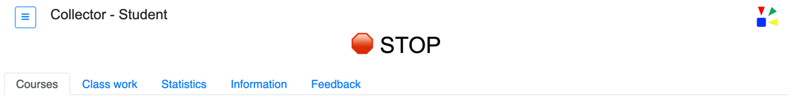

 

----

#### - Clear Timer

When the __Clear Timer__ menu item is selected the timer display information is removed from the user interface.  There is no other display modal shown when this menu item is selected.

----

#### - Update course catalog

The following display modal is shown when the __Update course catalog__ menu item is selected.  Press the button labeled: *Update*, to retrieve the latest course catalog from the instructor.  

Processing messages are shown in the display modal indicating the completion status.  

 * Pass message -  `Updated completed successfully`  
 * Fail message - `Update failed:  ECONNREFUSED` 
 
 The ECONNREFUSED portion of the fail message may change based on the error that has occurred.

Press the button labeled: *Close* without pressing the update button to cancel and exit without updating the course catalog.  

----

#### - Language

The following display modal is shown when the __Language__ menu item is selected.  

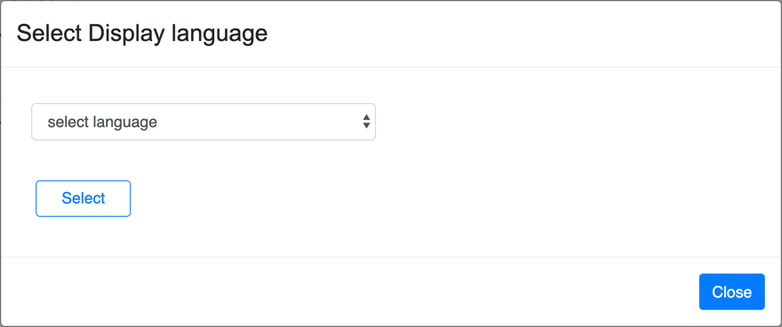

  

Select the desired user interface language from the drop down option list.  Press the button labeled: *Select*, to set the user interface to the selected language.

 

Example of the Language menu display modal with language __French__ having been selected and set.

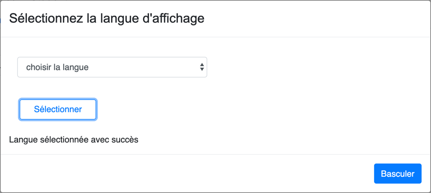

----

 

#### Instructor only menu options

The instructor persona is also provided the additional menu options:

* __Upload course__ - Add a course to the existing course catalog instance via a drag-n-drop interface.
* __Validate courses__ - Validate the course to ensure it will be processed properly within the instruction process of Collector.
* __Publish courses__ - Publish course content to catalog for downloading by student.
* __Delete course__ - Delete a single course "md" (markdown) file from the *coursecatalog* directory.
* __Teams__ - View the defined team (or) student names and colors that are used when displaying statistics.
* __Print course to PDF__ - Create a PDF file of the course content.

#### - Upload course

The following display modal is shown when the __Upload course__ menu item is selected.  This feature allows the instructor persona to add new course content.  Courses are comprised of one or more files.  The primary content for the course is a file that is created using Markdown.  Markdown is a lightweight markup language with plain text formatting syntax. Refer to the documentation topic: *Course authoring* for detailed information regarding the creation of course content.

Drag one or more course files to the file drop area, inside the dashed blue border in the display.

  

If the file successfully uploads a box with a checkmark will be displayed for a short period.  The checkmark then is removed and a box with the file size is displayed.

| Description | Image |
| :--- | :---: |
| checkmark| 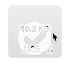 |
| success |   |

 

If the file fails to upload a box with an __X__ is shown in the file drop area.

The next step after uploading course content is to validate the content using the *Validate courses* menu item.   

----

#### - Validate courses

When the __Validate courses__ menu item is selected the initial display modal will be comprised of a title with a spinning graphic.  This spinning graphic will continue until the validation process has completed, at which time the following display modal is shown.

Each course that is validated will have output shown in this display.  The first message for each course validated starts with: __Processing course__, followed with the user defined course title.  This initial message is then followed with any additional course parameters that are defined for the course.  For a complete list of the possible course parameters that could be shown refer to the documentation topic labeled: *Course parameters*.  Also refer to the documentation topic: *Course authoring* for detailed information regarding the creation of course content.

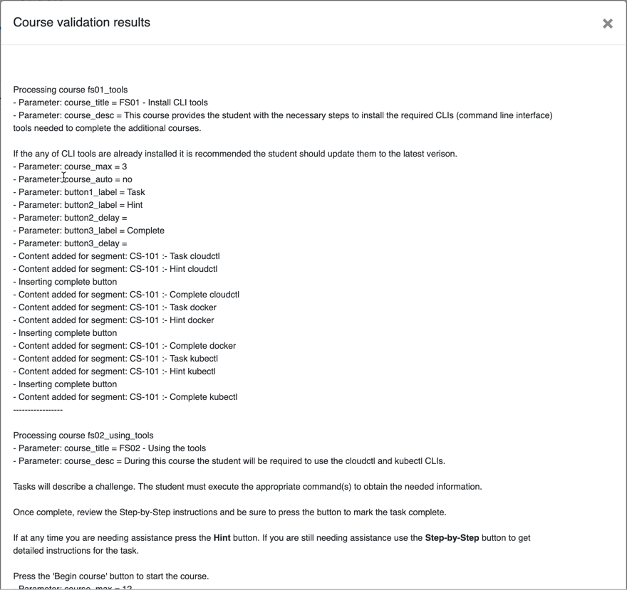

----

#### - Publish course

The following display modal is shown when the __Publish courses__ menu item is selected.  Publishing a course will make the course available for students.  

If the course is available the 'Published' column will have the value __Yes__.  Otherwise the column will contain __No__. To change the "Published" status of the course press the 'Toggle' button on the same line as the course in the displayed table.  Once completed the 'Published' column should change to the desired state.  

 
The following display shows the result of when the last two courses in the table have been "Toggled" to indicate the courses will not be published and available.

From the main user interface __Courses__ tab the drop down of courses will change to indicate only the published courses.  

Note:  
`
The updating of the drop down in the Courses tab for the student persona occurs after the menu item 'Update course catalog' has been selected and processed.
`

Examples of the changes in the course drop down in the Course tab are shown below.  

| Description | Course catalog dropdown |
| :--- | :---: |
| Four courses published | 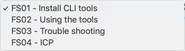 |

| Description | Course catalog dropdown |
| :--- | :---: |
| Two courses published |  |

  

----

#### - Delete course

The following display modal is shown when the __Delete course__ menu item is selected. 

Course files can be deleted from the course catalog directory.  This menu option will __DELETE__ the course file that is selected.  There is __NO__ validation of the delete request.  

Use this option with caution as the file is deleted from the course catalog directory.  If deleted by accident use the *Upload course* menu item to recover the course.  This recovery does assume the course file is available outside of the Collector application. 

From the drop down in the display modal select the course file to be deleted.  Then press the button labeled: *Delete*, to remove the file from the course catalog directory.

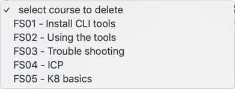

Example display modal after the delete course process has completed.

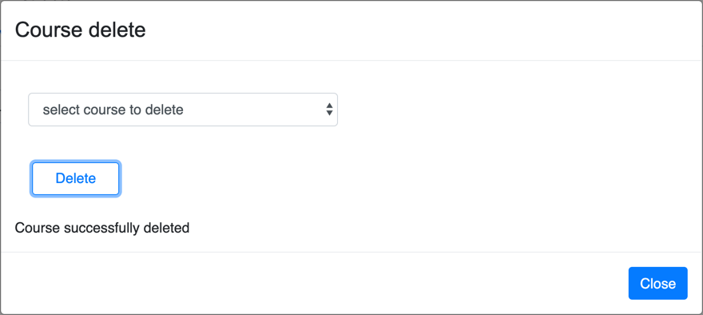

 

----

#### - Teams

The following display modal is shown when the __Teams__ menu item is selected.

The display modal has the complete list of team names and color combinations as defined in the configuration file __team.json__.  

Close the display by pressing the button labeled: *Close*, or click outside the display modal area.

The above image shows teams with different names and colors.  These values for the teams names and the color combinations are defined as a starting point and can be modified.  

Edit the file __teams.json__ to change the names and/or colors.  The file uses a JSON format that identifies each team and color set.  For brevity, the following example provides only the information used to create the first six teams in the above image.

The use of color names is not required.  Yet, each team name must be unique.   The __color__ parameter is not required to be unique and defined using hex notation.  Valid values for the __text__ parameter are *white* or *black*. 

The __teams.json__ file is also used when generating deployment yaml files.  Refer to the documentation section *Generating deployment file* for additional information.

 

----

#### Optional menu option

The student persona and instructor persona may also include the following menu options:

* __Print course to PDF__ - Create a PDF of the course content

---- 

#### - Print course to PDF
The following display modal is shown when the __Print course to PDF__ menu item is selected.

This feature provides the ability for the instructor or student to create a PDF for the selected course.  This menu option will only be shown if configured in the instructor and student configuration files, __configInstructor.json__ and __configStudent.json__ respectively.  Refer to the documentation section titled: *Configuration* for additional information on configuring the print menu option.

Example drop down with a list of courses that can be printed.  Select a course from the drop down to produce the PDF for that course.

Once a course has been selected press the button labeled: *Print* to generate the PDF.

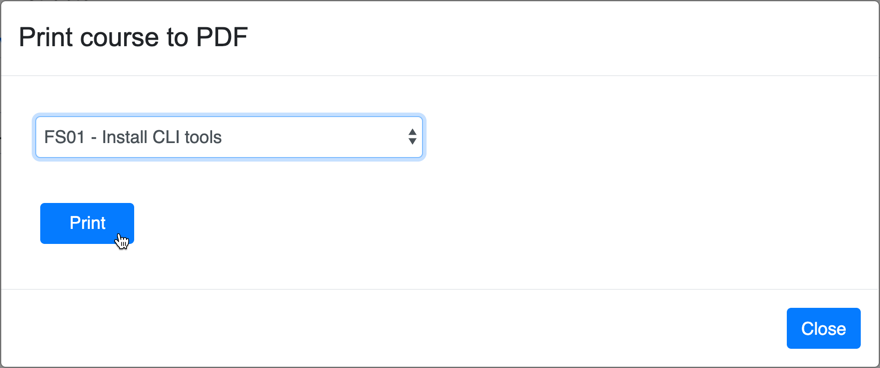

Once the PDF has been created it may be reviewed by clicking the 'Preview generated PDF' link.  This will open the newly generated PDF in a browser for review.

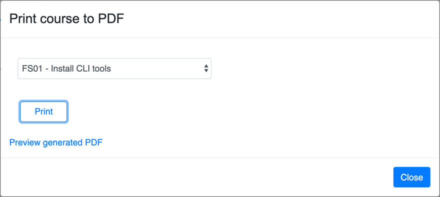

Example screen of reviewing the PDF in the browser viewer.  The course title and the date the PDF is generated in shown in the header of each page of the PDF.  The content of the course that is available within Collector is included in the PDF. 

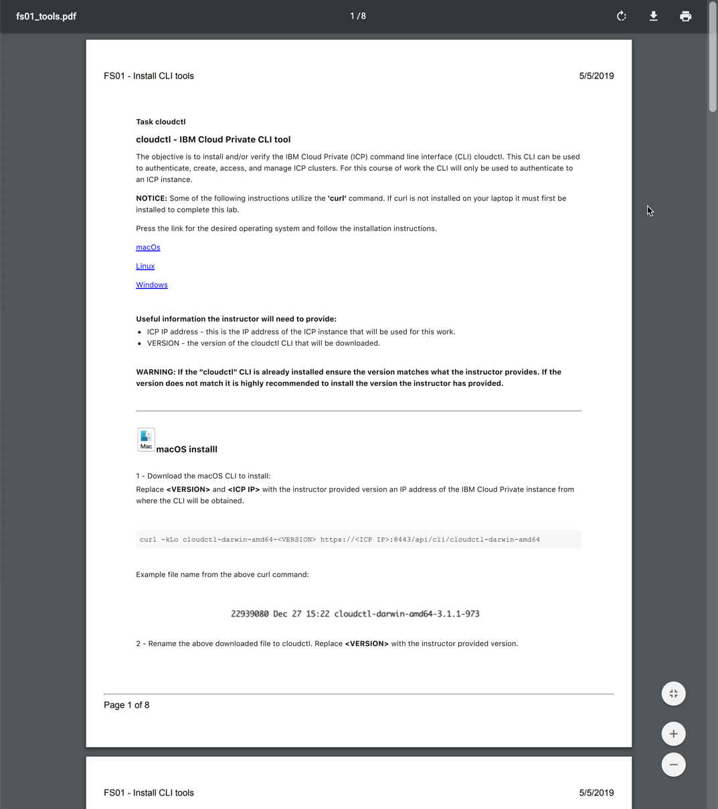

 

----
