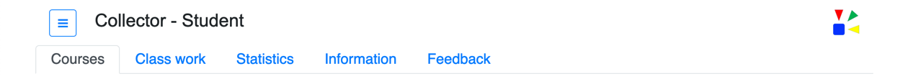
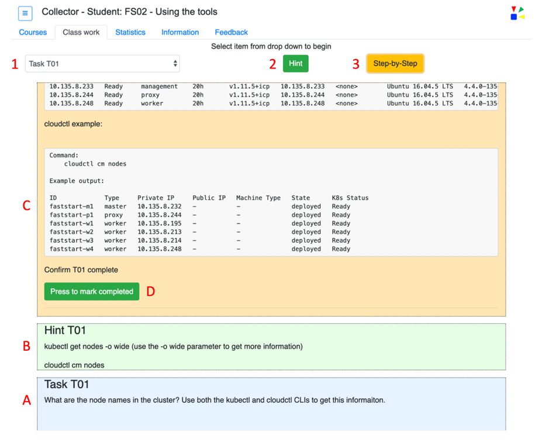
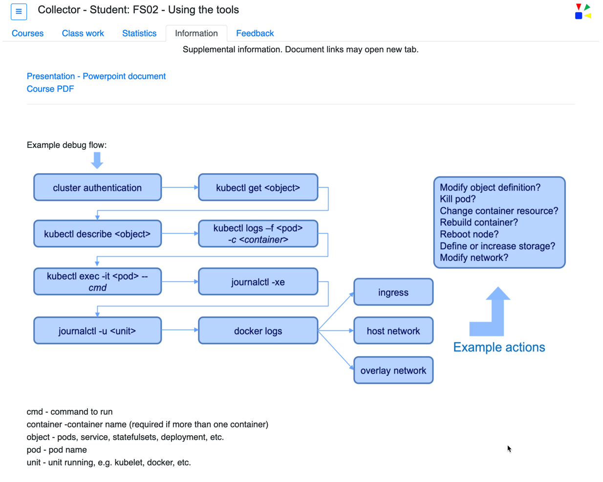
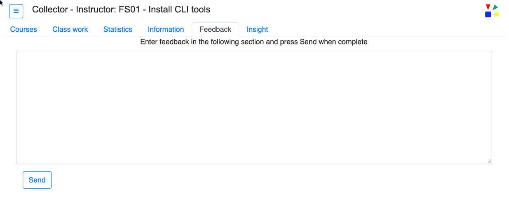
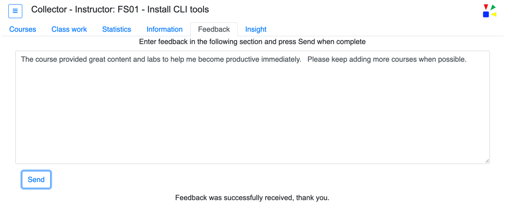
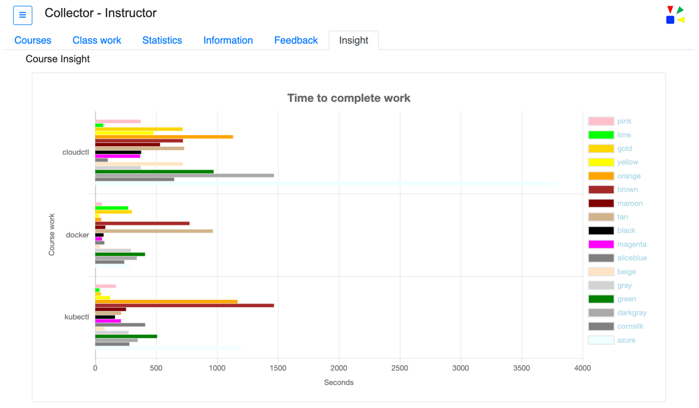
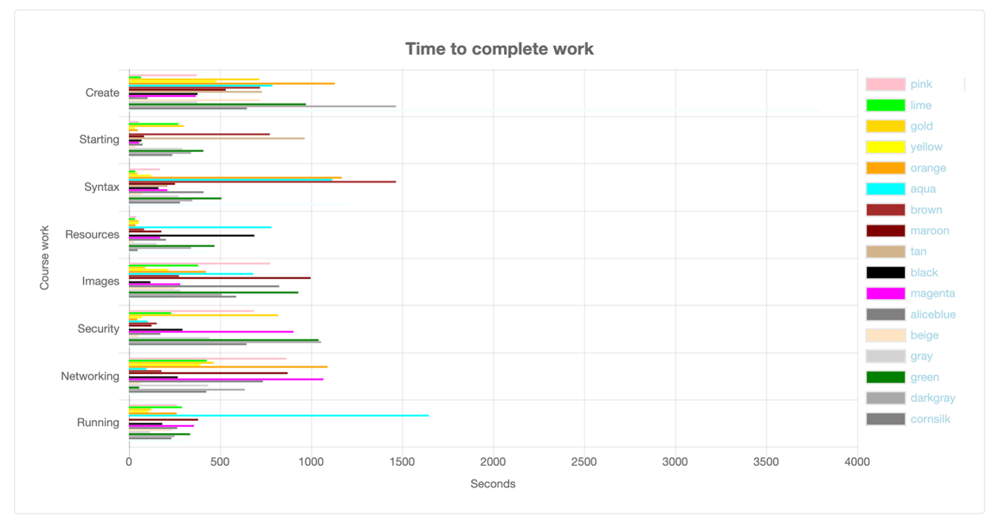
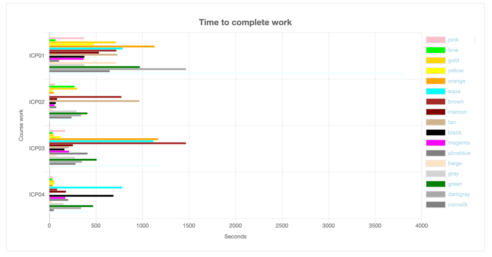
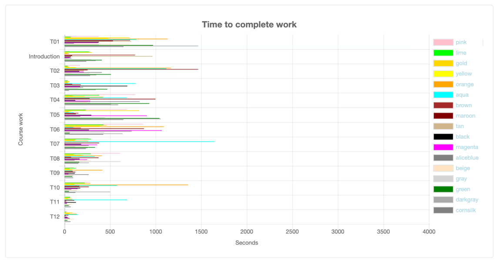

Once the Collector Url is launched in a browser the main user interface (UI) is displayed.  This UI exposes all features of the application.  There is a header portion of the UI that includes a menu navigation button, located in the upper left corner.  This is followed with the application name, Collector. Then followed with the team or student name, and if selected a course name.

Below the header is a series of tabs.  These tabs are described below.

#### Core tabs

The student and instructor personas are provided with the following main user interface tabs.

* __Courses__ - A drop-down menu of available courses with a 'Begin Course' button.
* __Class work__ - This is where the course content is presented.  
* __Statistics__ - Provides a tracking of the current completed course work.
* __Information__ - Information that may be helpful in the completion of the course is provided on this tab.
* __Feedback__ - Provides the ability to submit feedback.  

----

#### - Courses

The main UI __Courses__ tab is the default screen when the UI is launched.  The tab provides a catalog of available courses.  The courses are identified in a drop down.  

{: .boxit}

The course titles shown in the drop down can change based on the courses the instructor has published.  The updating of this drop down is accomplished by selecting the menu item *Update course catalog*.  Refer to that section of the documentation for more information regarding this capability.

 

Once a course is selected, if defined by the course author, a brief description of the course will be shown below the drop down list.  This description contains content as defined by the course author. 

To start the course press the button labeled: *Begin Course*.  

Example: A selected course with the course description shown. 

`
Refer to the *Course authoring* section of this documentation for detailed information on creating courses.
`
 

----

#### - Class work

From the Courses tab once a course has been selected and the *Begin course* button has been pressed the __Class work__ tab will be shown.  This tab has a drop down of the available work for this course.  This content of the drop down is dynamic and will change based on the course selected what the course author defined.  

`
In the following descriptions when a number and/or capital letter is referenced please refer to the matching red-number or red-letter in the image below the descriptions.
`

Course work items can be selected, see red number 1.  Once a work item is selected the UI will change based on the course content as defined by the course author.  

The changes to the UI are dynamic and based on the course content.  Zero, one or two number of buttons will be shown, see red-numbers 1 and 2.  The button labels can also change.  The buttons may be defined with delays before being shown, see red-numbers 1 and 2.

One, two, or three work display areas may be shown.  The size and color of these work area can be defined by the course author, see red-letters A, B, and C.  

When a work item, see red number 1, is selected a single display work area is shown, see red-letter A.  The selecting of the work item will also cause other portions of the screen to be modified.  

As the optional buttons, red-numbers 2 and 3, are pressed the corresponding display work area is shown.  In the example below when the button identified with the red-number 2 is pressed the display work area identified with the red-letter B is shown.  Pressing button labeled with the red-number 3 will show the display work area labeled with the red-letter C.  

The course author can optionally define what is known as a __Complete__ button.  If defined, see red letter D, the student would press this button when they have completed the course work.  The completion information is tracked on the __Statistics__ tab.

 

----

#### - Statistics

The __Statistics__ tab will display the progress of the work for the currently started course.  Refer to documentation topic *Courses* for how to start a course.  

After a course is started this tab will show a series of red circles, non-completed work, and green checkmarks, completed work.  The number of red circles an ultimately green checkmarks is dynamic based on the number of work items defined in the course.  

The number of red circles shown before any work is completed is equal to the number of work items defined by the course author.  The number of green checkmarks that are shown is controlled by the number of completed work items.  Completing a work item is an activity the student does while taking the course.   

Completing a work item requires the course author has defined a complete button in the course.  Or the course author has defined and using the auto complete feature.  Refer to the Auto complete section of the documentation for details on how to use this feature.

 

----

#### - Information

The __Information__ tab will display any additional information the course author would like to make available to the student.  

This additional information is defined by the course author using the course parameter __:infotab:__.  Refer to the documentation topics *Course parameters* and *Course authoring* for additional information regarding how to define the content on the Information tab.    

Example: Information tab shown below with hyperlinks and an image.

 

----

#### - Feedback

The Feedback tab provides the ability for the student to submit comments and feedback to the course instructor.  

Example Feedback tab with no comments entered.  

Example: Feedback tab with comments entered and the button labeled *Send* having been pressed.  The confirmation message that the feedback was received is shown on the bottom portion of the screen.

 

----

#### Instructor only tab 

The instructor persona only is provided the following main user interface tab.  

* __Insights__ - A graphical view of each course durations by team.

 

---- 

#### - Insight

The __Insight__ tab provides a graphical view of the *Time to complete work* by each team for a course.  The graphical view may include information for more than one course.  

Course work items are listed on the left axis while the Seconds of duration are shown on the bottom axis.

Example: Insight tab with four courses and completion times.

 

----
