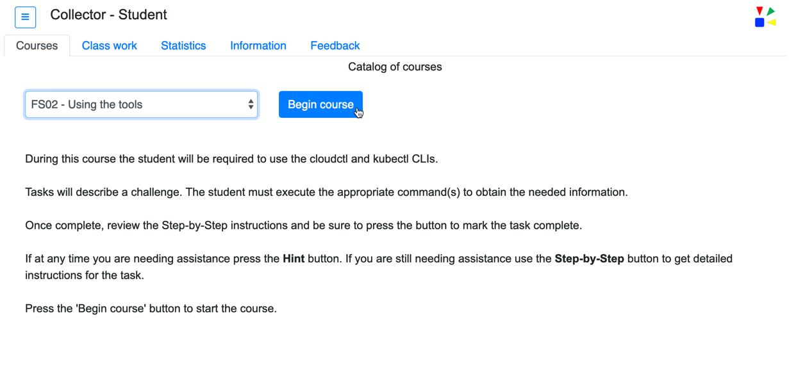

The main UI __Courses__ tab is the default screen when the UI is launched.  The tab provides a catalog of available courses.  The courses are identified in a drop down.  

`
The course titles shown in the drop down can change based on the courses the instructor has published.  The updating of this drop down is accomplished by selecting the menu item *Update course catalog*.  Refer to that section of the documentation for more information regarding this capability.

 

Once a course is selected, if defined by the course author, a brief description of the course will be shown below the drop down list.  This description contains content as defined by the course author. 

To start the course press the button labeled: *Begin Course*.  

Example: A selected course with the course description shown. 

`
Refer to the *Course authoring* section of this documentation for detailed information on creating courses.
`
 

----
