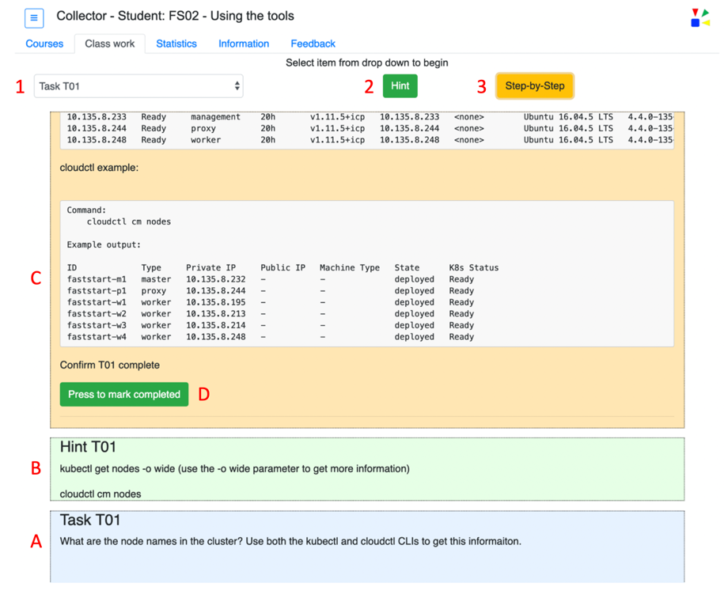

On the Courses tab once a course has been selected and the *Begin course* button has been pressed the __Class work__ tab will be shown.  This tab has a drop down of the available work for this course.  This content of the drop down is dynamic and will change based on the course selected what the course author defined.  

`
In the following descriptions when a number and/or capital letter is referenced please refer to the matching red-number or red-letter in the image below the descriptions.
`

Course work items can be selected, see red number 1.  Once a work item is selected the UI will change based on the course content as defined by the course author.  

The changes to the UI are dynamic and based on the course content.  Zero, one or two number of buttons will be shown, see red-numbers 1 and 2.  The button labels can also change.  The buttons may be defined with delays before being shown, see red-numbers 1 and 2.

One, two, or three work display areas may be shown.  The size and color of these work area can be defined by the course author, see red-letters A, B, and C.  

When a work item, see red number 1, is selected a single display work area is shown, see red-letter A.  The selecting of the work item will also cause other portions of the screen to be modified.  

As the optional buttons, red-numbers 2 and 3, are pressed the corresponding display work area is shown.  In the example below when the button identified with the red-number 2 is pressed the display work area identified with the red-letter B is shown.  Pressing button labeled with the red-number 3 will show the display work area labeled with the red-letter C.  

The course author can optionally define what is known as a __Complete__ button.  If defined, see red letter D, the student would press this button when they have completed the course work.  The completion information is tracked on the __Statistics__ tab.

 

----
