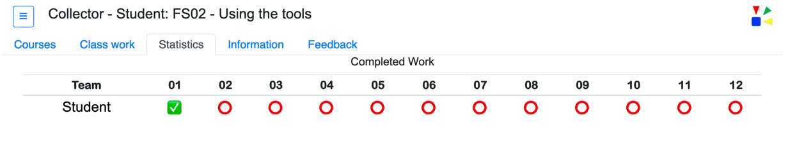

The __Statistics__ tab will display the progress of the work for the currently started course.  Refer to documentation topic *Courses* for how to start a course.  

After a course is started this tab will show a series of red circles, non-completed work, and green checkmarks, completed work.  The number of red circles an ultimately green checkmarks is dynamic based on the number of work items defined in the course.  

The number of red circles shown before any work is completed is equal to the number of work items defined by the course author.  The number of green checkmarks that are shown is controlled by the number of completed work items.  Completing a work item is an activity the student does while taking the course.   

Completing a work item requires the course author has defined a complete button in the course.  Or the course author has defined and using the auto complete feature.  Refer to the Auto complete section of the documentation for details on how to use this feature.

 

----
