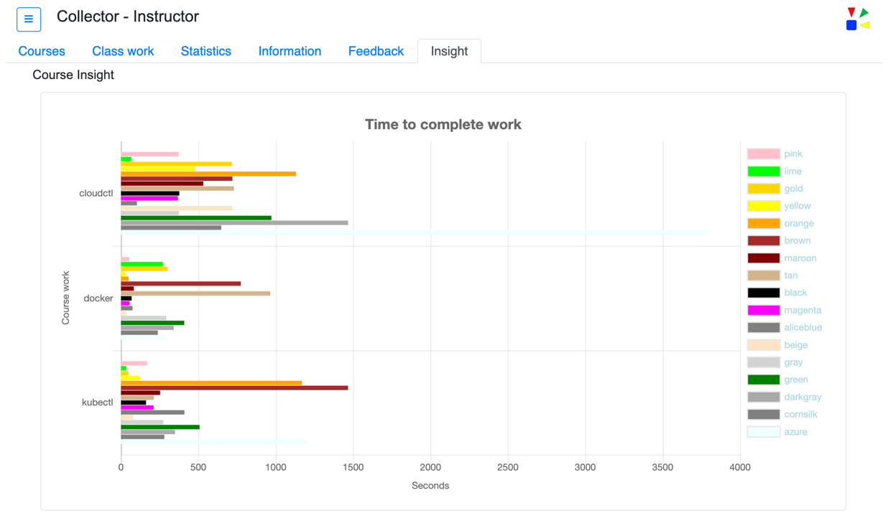
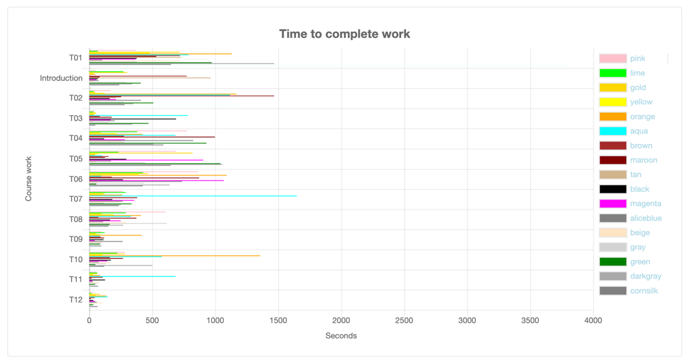

The __Insight__ tab provides a graphical view of the *Time to complete work* by each team for a course.  The graphical view may include information for more than one course.  

Course work items are listed on the left axis while the Seconds of duration are shown on the bottom axis.

Example: Insight tab with four courses and completion times.

 

----