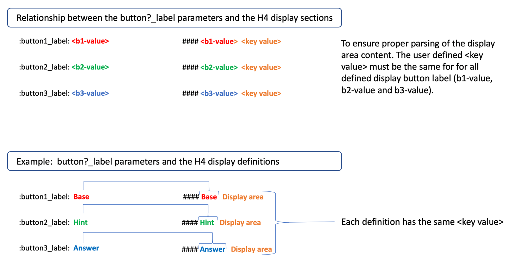
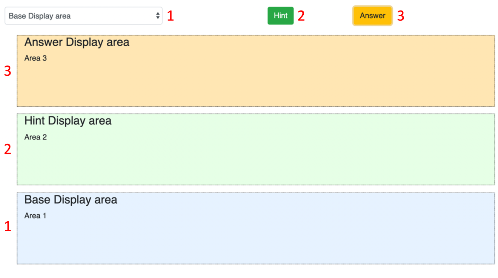

The course content used within Collector is created using Markdown.  Markdown is a lightweight markup language with plain text formatting syntax. Its design allows it to be converted to many output formats.  

Course markdown content can be created with a simple text editor or a full-fledged Markdown authoring application.  

Each course requires a set of parameters be defined that will control displaying and rending of content for the Collector tabs:

* Courses
* Class work
* Information

A complete list of the course parameters with a brief description and default values is provided in the documentation topic *Course parameters*.  Please review this [link](./080_courseParameters.md#Parameters) for parameters.

### Display areas and buttons

The content shown in each of the display work areas, described below, is defined in the course markdown by using a combination of the course parameters a.) __button1_label__, b.) __button2_label__, and c.) __button3_label__  along with a user defined H$ (####) display labels.  The following diagrams provides an example of the parameters and their relationship. 

 

The following image provides the rendering of the display areas 1, 2 and 3 along with buttons that would be generated by using the above parameters.  In the example Base, Hint, and Answer are the selected values for the __button?_label__  parameters.  

The values shown on buttons, marked as red-numbers 2 and 3, use the values from parameters __button2_label__ and __button3_label__.

