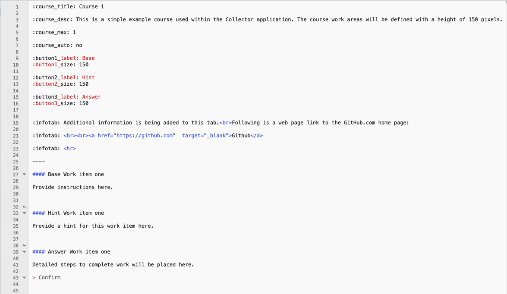
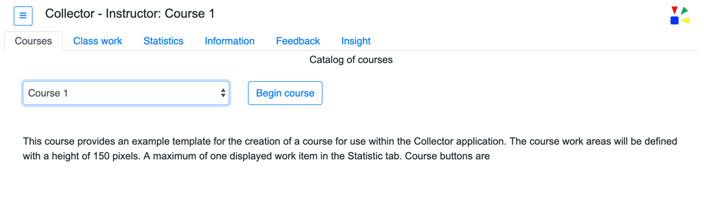
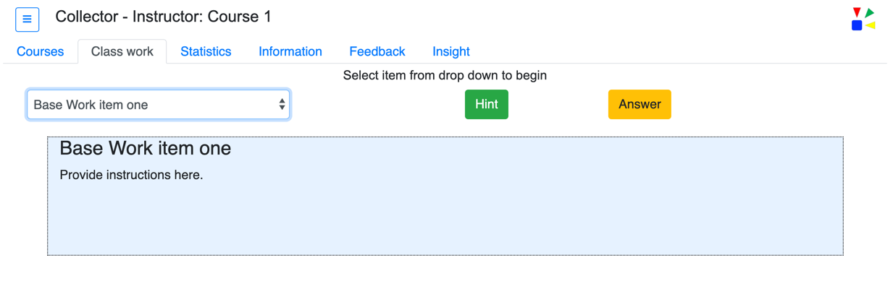
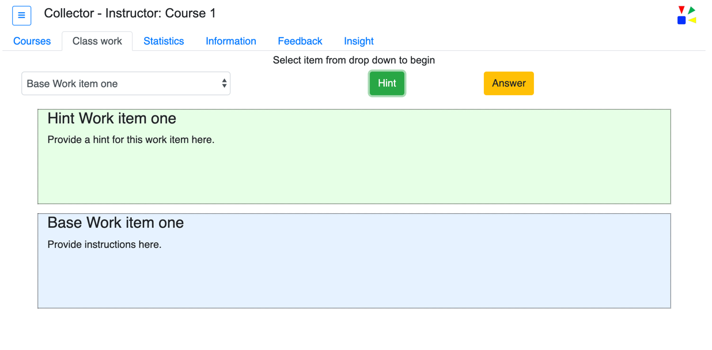
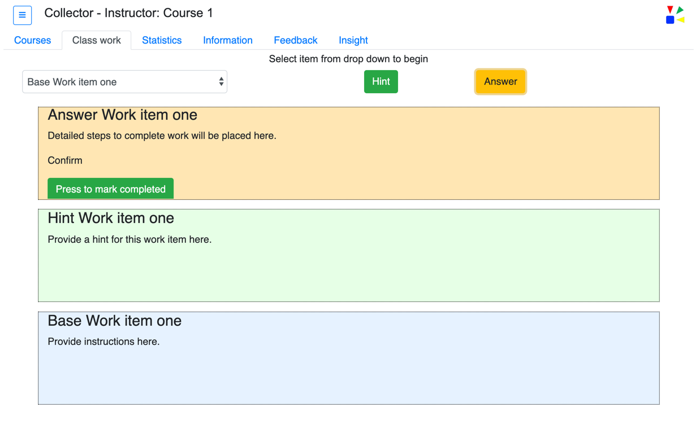
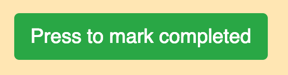
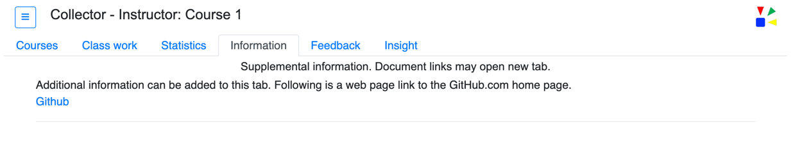
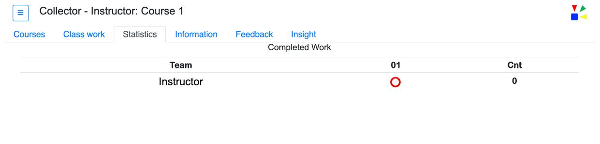
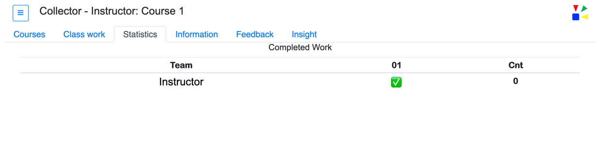

## Example Courses

This documentation provides example course Markdown along with output renderings that are produced by the course parameters.

#### Example Course 1

This simple example course used within the Collector application. The course work areas will be defined with a height of 150 pixels.  Course buttons are: Base, Hint, and Answer.  The single work item is labeled 'Work item one'.  A maximum of one displayed work item in the Statistics tab.  

----

#### - Course 1 : Part 1

* Line 1 - defines the course title of __Course 1__.  This title is used in the drop down on the *Courses* tab.

* Line 3 - defines the course description. The course description is shown when the course title is selected from the drop down on the *Courses* tab.

Example of rendered output from lines 1 and 3:

----

#### - Course 1 : Part 2

* Lines 9 - define the button1_label value that will be used with display area one and the drop down value for work items.

* Lines 27-32 - defines display area one content.  

* Line 27 uses the H4 (####) tag with button1_label followed by key value __Work item one__.  

Example of rendered output:

----

#### - Course 1 : Part 3

* Lines 12 - define the button2_label value that will be used with display area two and the value shown on the button two.

* Lines 33-38 - defines display area two content.  

* Line 33 uses the H4 (####) tag with button2_label followed by key value __Work item one__.   

Example of rendered output:

----

#### - Course 1 : Part 4

* Lines 15 - define the button3_label value that will be used with display area three and the value shown on the button three.

* Lines 39-43 - defines display area three content.  

* Line 39 uses the H4 (####) tag with button3_label followed by key value __Work item one__.  

* Line 43 - defines the __Complete button__.

Example of rendered output:

Example Complete button

----

#### - Course 1 : Part 5

* lines 19-23 - define the content to be shown on the __Information__ tab.

Example of rendered output:

----

#### - Course 1 : Part 6

* Line 5 - define the maximum number of items to display on the __Statistics__ tab.

Example of rendered output:

When the __Complete button__ is pressed the information in the __Statistics__ tab will show the completion of work.

Example of rendered output:

 

----
