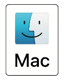

:course_title: FS01 - Access CLI tools

:course_desc: This course provides the student with the necessary steps to access the required CLIs (command line interface) tools needed to complete the additional courses. <br><br>Access to the tools is via a SSH session to a remote server.

:course_max: 3

:button1_label: Task
:button1_color: #e6f2ff'
:button1_size: 350

:button2_label: Hint
:button2_delay: 0
:button2_color: #e6ffe6
:button2_size: 100

:button3_label: Complete
:button3_delay: 0
:button3_color: #ffe6b3
:button3_size: 200


:infotab: <br><a href="https://github.com/IBM-ICP-CoC/fs-course/blob/master/Presentation.pptx"  target="_blank">Presentation - Powerpoint document </a>

:infotab: <br><a href="https://github.com/IBM-ICP-CoC/fs-course/blob/master/fs02_using_tools.pdf"  target="_blank">Course PDF</a>

:infotab: <hr>

:infotab: <br><br>Example debug flow:

:infotab: <br>cmd - command to run

:infotab: <br>container -container name (required if more than one container)

:infotab: <br>object - pods, service, statefulsets, deployment, etc.

:infotab: <br>pod - pod name

:infotab: <br>unit - unit running, e.g. kubelet, docker, etc.

----
----


:section_1: Task SSH session

<br>
The objective of this task is to have the student start a SSH session.  The SSH session will connect to a server that will be used for tasks in this course and all other courses.  The target server has the tools installed that are needed for these courses.


Press the link for the desired operating system and follow the instructions. 


[macOs](#macOS_ssh)

[Linux](#Linux_ssh)

[Windows](#windows_ssh)


__Useful information the instructor will provide:__

- IP address - this is the IP address of the server that will be used.
- TEAM - the team name will be used.

<br>


----

<a name="macOS_ssh"></a>

&nbsp;
### macOS ssh

<br>
1 - Open terminal session on local machine

Using an already installed terminal software start the program.  This should result in a new terminal session on your machine.

<br>

2 - Enter the ssh command:

```

Command:

	ssh <team>@<IP address>

Example output:

	Macbook$ ssh team01@52.117.155.21
	
	team01@52.117.155.21's password:     <<<--- enter team password
	
	Last login: Thu Sep 19 17:48:39 2019 from cpe-74-213-21-226.austin.res.rr.com

	[team01@server ~]$
	

```

Press the Complete button to view the final instructions for this task.


----

<a name="Linux_ssh"></a>

&nbsp;
### Linux ssh

<br>

1 - Open terminal session on local machine

Using an already installed terminal software start the program.  This should result in a new terminal session on your machine.

<br>

2 - Enter the ssh command:

```

Command:

	ssh <team>@<IP address>

Example output:

	Macbook$ ssh team01@52.117.155.21
	
	team01@52.117.155.21's password:     <<<--- enter team password
	
	Last login: Thu Sep 19 17:48:39 2019 from cpe-74-213-21-226.austin.res.rr.com

	[team01@server ~]$
	

```

Press the Complete button to view the final instructions for this task.


----

<a name="Windows_ssh"></a>

&nbsp;
### Windows ssh


__NOTICE__ These instructions assume that Windows 10 is being used.
 
<br>

1 - Open Power Shell 

Open Power Shell


<br>

2 - Enter the ssh command:

```

Command:

	ssh <team>@<IP address>

Example output:

	PS C:\Users\dave ssh team01@52.117.155.21
	
	team01@52.117.155.21's password:     <<<--- enter team password
	
	Last login: Thu Sep 19 17:48:39 2019 from cpe-74-213-21-226.austin.res.rr.com

	[team01@server ~]$
	

```

Press the Complete button to view the final instructions for this task.


----

:section_2: Hint SSH session


If needed there will be a hint provided to assist in completing this task.


:section_3: Complete SSH session


#### Verify the SSH session has been started

<br>

> ConfirmButton SSH session


----

:section_1: Task oc version 


The objective of this task is to have the student use the __oc__ CLI and determine the version that is installed.  

``
Command:

	oc version

Example output:

	oc version
	oc v3.11.0+0cbc58b
	kubernetes v1.11.0+d4cacc0
	features: Basic-Auth GSSAPI Kerberos SPNEGO


``

Press the Complete button to view the final instructions for this task.


:section_2: Hint oc version


If needed there will be a hint provided to assist in completing this task.


:section_3: Complete oc version


#### Verify completion of this task

<br>

> ConfirmButton oc version


----

:section_1: Task docker version


The objective of this task is to have the student use the __docker__ command and determine the version that is installed.  

``
Command:

	docker version

Example output:

	Client:
	Version:         1.13.1
	API version:     1.26


``

Press the Complete button to view the final instructions for this task.


:section_2: Hint docker version


If needed there will be a hint provided to assist in completing this task.


:section_3: Complete docker version


#### Verify completion of this task

<br>

> ConfirmButton docker version
