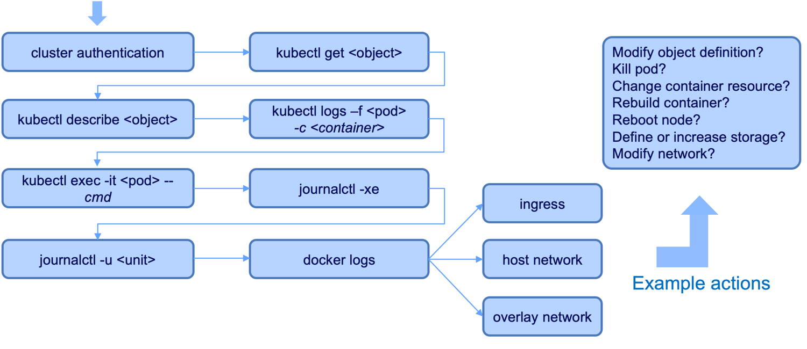

:course_title: FS03 - Trouble shooting

:course_desc: This course provides the student with the opportunity to trouble shoot multiple problems regarding containers, security, yaml, networking, resources, etc. <br><br>The first lab the student will deploy a new pod to gain an understanding of the process.  All other labs will use the approach of having the team/student research exisitng pods, diagnose the issue, and then resolve the issue.  <br><br>Once the issue is successfully resolved the running container will report the completion of the lab.  No manual process is needed to indicate completion of the lab.

:course_auto: yes
:course_auto_links: house=Create,baker=Syntax,carbon=Resources,doors=Images,avail=Security,eagle=Networking,floor=Running,gonzo=Starting,igloo=Readiness

:course_max: 8

:button1_label: Lab
:button1_size: 500
:button1_color: #e6f2ff

:button2_label: Hint
:button2_size: 100
:button2_delay: 1000
:button2_color: #e6ffe6

:button3_label: Step-by-Step
:button3_size: 500
:button3_delay: 30000
:button3_color: #ffe6b3

:infotab: <br><a href="https://github.com/IBM-ICP-CoC/fs-course/blob/master/Presentation.pptx"  target="_blank">Presentation - Powerpoint document </a>

:infotab: <br><a href="https://github.com/IBM-ICP-CoC/fs-course/blob/master/fs03_diagnose_labs.pdf"  target="_blank">Course PDF</a>

:infotab: <hr>

:infotab: <br><br>Example debug flow:

:infotab: <br>cmd - command to run

:infotab: <br>container -container name (required if more than one container)

:infotab: <br>object - pods, service, statefulsets, deployment, etc.

:infotab: <br>pod - pod name

:infotab: <br>unit - unit running, e.g. kubelet, docker, etc.

----
----
:section_1: Lab Create

This lab is intended to get the team familar with creating a pod in the team namespace.  There is no diagnosis or problem to be researched.  The lab is complete once the pod is created in the team namespace.

#### Resources
* K8 yaml - [house.yaml](https://github.com/IBM-ICP-CoC/fs-course/blob/master/usefulFiles/house.yaml)
* Dockerfile - [Dockerfile](https://github.com/IBM-ICP-CoC/fs-course/blob/master/usefulFiles/house_Dockerfile)

#### Useful information

| Item | Value  |
| :--- | :--- |
| cpu:| 50m |
| memory: | 50Mi |
| image: | ibmicpcoc/house:latest |
| ports | none |
| Docker | CMD ["/bin/bash", "-c", "./house.sh"] |

----

| Task description  |
| :--- |
| Download the resource K8 yaml file. |
| Edit and save the file after replacing all references of __&#60;team&#62;__ with your team name. |
| Create the K8 objects using oc create |
| Did the pod deploy successfully?  If not, correct the issue and re-create the K8 objects. |

----

:section_2: Hint Create

To create the pod use the command: __oc create -f &#60;file&#62;;__   (replace &#60;file&#62; with the name of the yaml file you have saved an editied.)

----

:section_3: Step-by-Step Create

#### Diagnosis

No diagnosis is necessary for this lab.  A new pod should be created after editing the yaml file and using the oc create command.

#### Problem discovered

N/A

#### Resolution

Edit the yaml file and modify all references of &#60;team&#62; to your team name.

```	
Example yaml file that needs to be edited.

--- # Fast Start :: Problem Diagnosis and Troubleshooting Lab 
---
apiVersion: apps/v1    
kind: Deployment
metadata:
  name: <team>-house
  namespace: <team>
  labels:
    app: <team>-house
spec:
  selector:
    matchLabels:
      app: <team>-house
  replicas: 1
  template:
    metadata:
      labels:
        app: <team>-house
    spec:
      containers:
      - name: <team>-house
        image: ibmicpcoc/house:latest
        imagePullPolicy: Always
        command: ["/bin/bash", "-c", "/app/avail.sh"]
        env:
          - name: APP_NAMESPACE
            valueFrom:
              fieldRef:
                fieldPath: metadata.namespace
          - name: APP_NAME
            valueFrom:
              fieldRef:
                fieldPath: metadata.name
          - name: COLLECTOR_CONFIG
            valueFrom: 
              configMapKeyRef:
                name: <team>-collector-config
                key: COLLECTOR_CONFIG
          - name: INSTRUCTOR_CONFIG
            valueFrom: 
              configMapKeyRef:
                name: <team>-collector-config
                key: INSTRUCTOR_CONFIG
        resources:
          requests:
            cpu: 100m
            memory: 100Mi

```

Saved the modified file and create the pod "house".

```
Command to create the K8 objects:
	oc create -f house.yaml
	
Result output:
	deployment.apps/house created


----
Verify the pod deployed successfully.
	
Command to get pods in namespace:
	oc -n <team> get pods         # change <team> to your team namespace

```

----
----
:section_1: Lab Syntax

All references to "team" or &#60;team&#62; should be replaced with your team name which is the same as your namespace.

Use the debug flow to guide the steps you should attempt in diagnosis of the issue.

#### Resources

* K8 yaml	- [baker.yaml](https://github.com/IBM-ICP-CoC/fs-course/blob/master/usefulFiles/baker.yaml)
* Dockerfile - [Dockerfile](https://github.com/IBM-ICP-CoC/fs-course/blob/master/usefulFiles/baker_Dockerfile)

#### Useful information

| Item | Value  |
| :--- | :--- |
| cpu:| 50m |
| memory: | 50Mi |
| image: | ibmicpcoc/baker:latest |
| ports | none |
| Docker | CMD ["/bin/bash", "-c", "./baker.sh"] |

----


| Task description  |
| :--- |
| Download the resource K8 yaml file. |
| Edit and save the file after replacing all references of &#60;team&#62; with your team name / namespace. |
| Research why the pod did not deploy. |
| Resolve the issue and create the K8 objects. |
| Did the pod deploy successfully?  If not, correct the issue and re-create the K8 objects. |

----

:section_2: Hint Syntax

Deployment.spec.template.spec.containers expects an array of entires.  

Arrays are defined with a hyphen.

Review and compare the __house.yaml__ file for an example of properly defined K8 objects.

----

:section_3: Step-by-Step Syntax

#### Diagnosis

When attempting to create the pod the yaml is not properly defined.  This error message is being shown:


error: error validating "baker.yaml": error validating data: ValidationError(Deployment.spec.template.spec.containers): invalid type for io.k8s.api.core.v1.PodSpec.containers: got "map", expected "array"; if you choose to ignore these errors, turn validation off with --validate=false


#### Problem discovered

The Deployment.spec.template.spec.containers portion of the yaml file is not properly formatted.  Got "map", expected "array".  Container does not have an array of entires.

#### Resolution

Edit the yaml file and correct the definition to include a hyphen before the "name:" parameter of the containers portion.


```	
Example saved file with hyphen  (portion of file shown below)

apiVersion: apps/v1
kind: Deployment
metadata:
  name: <team>-baker
  namespace: pink
  labels:
    app: <team>-baker
spec:
  selector:
    matchLabels:
      app: <team>-baker
  replicas: 1
  template:
    metadata:
      labels:
        app: <team>-baker
    spec:
      containers:
      - name: <team>-baker                 <=== Add the hyphen to this line 
        image: ibmicpcoc/baker:latest
        imagePullPolicy: Always

```


Saved the modified file and create the pod "baker".

```
Command to create the K8 objects:
	oc create -f baker.yaml
	
Result output:
	deployment.apps/baker created


----
Verify the pod deployed successfully.
	
Command to get pods in namespace:
	oc -n <team> get pods         # change <team> to your team namespace

```


----
----
:section_1: Lab Resources

All references to "team" or &#60;team&#62; should be replaced with your team name which is the same as your namespace.

Use the debug flow to guide the steps you should attempt in diagnosis of the issue.

----
----

#### Useful information

K8 yaml	- [carbon.yaml](https://github.com/IBM-ICP-CoC/fs-course/blob/master/usefulFiles/carbon.yaml)  
Dockerfile - [Dockerfile](https://github.com/IBM-ICP-CoC/fs-course/blob/master/usefulFiles/carbon_Dockerfile)  

| Item | Value  |
| :--- | :--- |
| spec.template.spec.containers[*].resouces.request.cpu| 100m |
| spec.template.spec.containers[*].resouces.request.memory: | 100Mi |
| spec.template.spec.containers[*].image: | ibmicpcoc/carbon:latest |
| spec.template.spec.containers[*].ports | none |
| Docker CMD | ["/bin/bash", "-c", "./carbon.sh"] |

----

| Task description  |
| :--- |
| Within your team namespace diagnose the pod that begins with __&#60;team&#62; -carbon__|
| Use the label option -l app=&#60;team&#62;-carbon when getting the pod information. |
| Download the resource K8 yaml file. |
| Edit and save the file after replacing all references of &#60;team&#62; with your team name / namespace. |
| Create the K8 objects. |
| Did the pod deploy successfully?  If not, correct the issue and re-create the K8 objects. |

----

:section_2: Hint Resources

* Describe the pod.
* Get events from the namespace, oc get events -n __&#60;team&#62;__
* A single cpu is defined with 1000m. The container cpu resources should use __1/10__ of a cpu.  

* Editing a running pod is another method to change the pod.  Use the command KUBE_EDITOR="nano" oc edit deployment/__&#60;team&#62;-carbon__  and edit the running pod.  Nano is the editor defined in the command.  Remove the KUBE_EDITOR parm to use the default editor on your machine.

----

:section_3: Step-by-Step Resources

#### Diagnosis

When attempting to deploy the pod the yaml file is not properly defined.

Check the Pod status

```	
Command:
	oc -n <team> get pods -l app=<team>-carbon.  # replace <team> 
	
Example output:
	NAME                              READY     STATUS    RESTARTS   AGE
	pink-carbon-5c96bc649-tjnhb       0/1       Pending   0          2m
	
```

Describe the pod

```
Name:               pink-carbon-5c96bc649-tjnhb
Namespace:          pink
Priority:           0
PriorityClassName:  <none>
Node:               <none>
Labels:             app=pink-carbon
                    pod-template-hash=175267205
Annotations:        kubernetes.io/psp=ibm-privileged-psp
Status:             Pending
IP:
Controlled By:      ReplicaSet/pink-carbon-5c96bc649
Containers:
  pink-carbon:
    Image:      ibmicpcoc/carbon:latest
    Port:       <none>
    Host Port:  <none>
    Requests:
      cpu:     25
      memory:  100Mi
    Environment:
      APP_NAMESPACE:      pink (v1:metadata.namespace)
      APP_NAME:           pink-carbon-5c96bc649-tjnhb (v1:metadata.name)
      COLLECTOR_CONFIG:   <set to the key 'COLLECTOR_CONFIG' of config map 'pink-collector-config'>   Optional: false
      INSTRUCTOR_CONFIG:  <set to the key 'INSTRUCTOR_CONFIG' of config map 'pink-collector-config'>  Optional: false
    Mounts:
      /var/run/secrets/kubernetes.io/serviceaccount from default-token-mq64m (ro)
Conditions:
  Type           Status
  PodScheduled   False
Volumes:
  default-token-mq64m:
    Type:        Secret (a volume populated by a Secret)
    SecretName:  default-token-mq64m
    Optional:    false
QoS Class:       Burstable
Node-Selectors:  <none>
Tolerations:     node.kubernetes.io/memory-pressure:NoSchedule
                 node.kubernetes.io/not-ready:NoExecute for 300s
                 node.kubernetes.io/unreachable:NoExecute for 300s
Events:
  Type     Reason            Age                 From               Message
  ----     ------            ----                ----               -------
  Warning  FailedScheduling  58s (x121 over 5m)  default-scheduler  0/4 nodes are available: 4 Insufficient cpu.
$
```

	
In the "Events" section review the "Message" from the entry with "Type" Warning and "Reason" FailedScheduling
<br>

```
...  0/4 nodes are available: 4 Insufficient cpu.
$
```

<br>

Example of Get Events in namespace

```
Command:
	oc -n <team> get events
	
Example output:

LAST SEEN   FIRST SEEN   COUNT     NAME                                            KIND         SUBOBJECT                      TYPE      REASON              SOURCE                    MESSAGE
7m          7m           1         pink-carbon.157be1efb7ad1a77                    Deployment                                  Normal    ScalingReplicaSet   deployment-controller     Scaled up replica set pink-carbon-5c96bc649 to 1
7m          7m           1         pink-carbon-5c96bc649.157be1efb85494ba          ReplicaSet                                  Normal    SuccessfulCreate    replicaset-controller     Created pod: pink-carbon-5c96bc649-tjnhb
2m          7m           121       pink-carbon-5c96bc649-tjnhb.157be1efb858b4b3    Pod                                         Warning   FailedScheduling    default-scheduler         0/4 nodes are available: 4 Insufficient cpu.
```


<br>

####  Problem discovered
	
Events output indicates the pod is FailedScheduling because there are not enough CPU resources available.

#### Resolution

At least two methods exist to correct the issue.  

> The first method is deleting the old pod, edit the yaml file, and re-create the pod.  
 
This approach is later referred to as: delete-create-pod

Edit the yaml file and modify <i>cpu</i> to decrease the amount of cpu to 10% of a single CPU.

<br>
Delete the running pod

```
Command to delete the existing pod: 
	oc delete -f carbon.yaml
		
Result output:
	deployment.apps "carbon" deleted
```


<br>
Edit file carbon.yaml (only a portion of file shown below)

```
	spec:
	  selector:
	    matchLabels:
         app: <team>-carbon
     replicas: 1
     template:
       metadata:
         labels:
           app: <team>-carbon
       spec:
         containers:
         - name: <team>-carbon
           image: ibmicpcoc/carbon:latest
           resources:
             requests:
               cpu: 25000m                   <=== change value to 100m
               memory: 100Mi
```


<br>
Create the k8 deployment
	
	Command:
		oc create -f carbon.yaml
	
	Result output:
	deployment.apps/<team>-carbon created

<br>

> The second method is editing the running pod.  Edit and save edit the file, and re-create the pod.  

This approach is later referred as: edit-running-pod


Edit the running pod.  The kubernetes object content is available in the editor (shown below).  Note the content has both the spec: and status: sections. 

Locate the line cpu: "25" and change the line to cpu: 100m (without quotes)

```	
Command to edit the running pod:
	KUBE_EDITOR="nano" oc edit deployment/<team>-carbon     # replace <team> 

Content shown when editor is open.  The pink-carbon deployment is being shown:

# Please edit the object below. Lines beginning with a '#' will be ignored,
# and an empty file will abort the edit. If an error occurs while saving this file will be
# reopened with the relevant failures.
#
apiVersion: extensions/v1beta1
kind: Deployment
metadata:
  annotations:
    deployment.kubernetes.io/revision: "1"
  creationTimestamp: 2019-01-21T14:01:56Z
  generation: 1
  labels:
    app: pink-carbon
  name: pink-carbon
  namespace: pink
  resourceVersion: "5834141"
  selfLink: /apis/extensions/v1beta1/namespaces/pink/deployments/pink-carbon
  uid: 1d02fbe9-1d85-11e9-b012-06ed6a534df5
spec:
  progressDeadlineSeconds: 600
  replicas: 1
  revisionHistoryLimit: 10
  selector:
    matchLabels:
      app: pink-carbon
  strategy:
    rollingUpdate:
      maxSurge: 25%
      maxUnavailable: 25%
    type: RollingUpdate
  template:
    metadata:
      creationTimestamp: null
      labels:
        app: pink-carbon
    spec:
      containers:
      - env:
        - name: APP_NAMESPACE
          valueFrom:
            fieldRef:
              apiVersion: v1
              fieldPath: metadata.namespace
        - name: APP_NAME
          valueFrom:
            fieldRef:
              apiVersion: v1
              fieldPath: metadata.name
        - name: COLLECTOR_CONFIG
          valueFrom:
            configMapKeyRef:
              key: COLLECTOR_CONFIG
              name: pink-collector-config
        - name: INSTRUCTOR_CONFIG
          valueFrom:
            configMapKeyRef:
              key: INSTRUCTOR_CONFIG
              name: pink-collector-config
        image: ibmicpcoc/carbon:latest
        imagePullPolicy: Always
        name: pink-carbon
        resources:
          requests:
            cpu: "25"                         <=== change value to 100m without quotes
            memory: 100Mi
        terminationMessagePath: /dev/termination-log
        terminationMessagePolicy: File
      dnsPolicy: ClusterFirst
      restartPolicy: Always
      schedulerName: default-scheduler
      securityContext: {}
      terminationGracePeriodSeconds: 30
status:
  conditions:
  - lastTransitionTime: 2019-01-21T14:01:56Z
    lastUpdateTime: 2019-01-21T14:01:56Z
    message: Deployment does not have minimum availability.
    reason: MinimumReplicasUnavailable
    status: "False"
    type: Available
  - lastTransitionTime: 2019-01-21T14:11:57Z
    lastUpdateTime: 2019-01-21T14:11:57Z
    message: ReplicaSet "pink-carbon-5c96bc649" has timed out progressing.
    reason: ProgressDeadlineExceeded
    status: "False"
    type: Progressing
  observedGeneration: 1
  replicas: 1	


NOTE: You must save the file for the changes to take effect.

Result output:
	deployment.extensions/pink-carbon edited

```

Did this resolve the issue?

```
Command to get pods in namespace: 
	oc -n <namespace> get pods

Example output:
	NAME                              READY     STATUS    RESTARTS   AGE
	pink-carbon-7784b95958-pctl5      1/1       Running   0          2m
```
	
<br>


----
----
:section_1: Lab Images

All references to "team" or &#60;team&#62; should be replaced with your team name which is the same as your namespace.

Use the debug flow to guide the steps you should attempt in diagnosis of the issue.

#### Resources

* K8 yaml	- [doors.yaml](https://github.com/IBM-ICP-CoC/fs-course/blob/master/usefulFiles/doors.yaml)
* Dockerfile - [Dockerfile](https://github.com/IBM-ICP-CoC/fs-course/blob/master/usefulFiles/doors_Dockerfile)


#### Useful information

| Item | Value  |
| :--- | :--- |
| cpu:| 50m |
| memory: | 50Mi |
| image: | ibmicpcoc/doors:latest |
| ports | none |
| Docker | CMD ["node", "app.js"] |
 
----


| Task description  |
| :--- |
| Within your team namespace diagnose the pod that begins with &#60;team&#62;-doors|
| Use the label option -l app=&#60;team&#62;-doors when getting the pod status.
| Download the resource K8 yaml file. |
| Use either of the delete-create-pod or edit-running-pod approaches to resolve the issue. |
| Did the pod deploy successfully?  If not, correct the issue and re-create the K8 objects. |

----

:section_2: Hint Images

Check the "tag" of the image that is being pulled. 

----

:section_3: Step-by-Step Images

#### Diagnosis

Pod status
	
	Command:
		oc -n <your namespace> get pods -l app=<team>-doors    (replace <team> )
	
	Example output:
	NAME                         READY     STATUS             RESTARTS   AGE
	pink-doors-78b7f6598d-p8kvf   0/1       ImagePullBackOff   0          10m

<br>

Describe the pod (complete output from command is shown)

```
Name:               pink-doors-78b7f6598d-p8kvf
Namespace:          pink
Priority:           0
PriorityClassName:  <none>
Node:               10.186.56.85/10.186.56.85
Start Time:         Mon, 21 Jan 2019 10:18:18 -0600
Labels:             app=pink-doors
                    pod-template-hash=3349118043
. . .
		portions of output removed
. . .

Events:
  Type     Reason     Age                From                   Message
  ----     ------     ----               ----                   -------
  Normal   Scheduled  46s                default-scheduler      Successfully assigned pink/pink-doors-78b7f6598d-p8kvf to 10.186.56.85
  Normal   Pulling    28s (x2 over 43s)  kubelet, 10.186.56.85  pulling image "ibmicpcoc/doors:last"
  Warning  Failed     27s (x2 over 43s)  kubelet, 10.186.56.85  Failed to pull image "ibmicpcoc/doors:last": rpc error: code = Unknown desc = Error response from daemon: manifest for ibmicpcoc/doors:last not found
  Warning  Failed     27s (x2 over 43s)  kubelet, 10.186.56.85  Error: ErrImagePull
  Normal   BackOff    12s (x3 over 42s)  kubelet, 10.186.56.85  Back-off pulling image "ibmicpcoc/doors:last"
  Warning  Failed     12s (x3 over 42s)  kubelet, 10.186.56.85  Error: ImagePullBackOff
```

Multiple Warning messages are displayed in the Event setion.  Review all of the Warning messages.
	
In the "Events" section review the "Message" from the entry with "Type" Warning and "Reason" Failed
<br>

```
...  Failed to pull image "ibmicpcoc/doors:last": rpc error: code = Unknown desc = Error response from daemon: manifest for ibmicpcoc/doors:last not found

(output is from the first Failed message)
```

<br>

####  Problem discovered
	
The image cannot be located as indicated by the "Failed to pull image" message.  The image tag last on the container is incorrect.  The image tag should be latest.


<br>

#### Resolution

The edit-running-pod is shown in the following example to resolve the issue:

```
Command to edit the running pod:
	KUBE_EDITOR="nano" oc -n <team> edit deployment/<team>-doors


Example is from the pink namespace.  Modify the tag of the image to "latest"


# Please edit the object below. Lines beginning with a '#' will be ignored,
# and an empty file will abort the edit. If an error occurs while saving this file will be
# reopened with the relevant failures.
#
apiVersion: extensions/v1beta1
kind: Deployment
metadata:
  annotations:
    deployment.kubernetes.io/revision: "1"
  creationTimestamp: 2019-01-21T16:18:18Z
  generation: 1
  labels:
    app: pink-doors
  name: pink-doors
  namespace: pink
  resourceVersion: "5853628"
  selfLink: /apis/extensions/v1beta1/namespaces/pink/deployments/pink-doors
  uid: 29914949-1d98-11e9-b012-06ed6a534df5
spec:
  progressDeadlineSeconds: 600
  replicas: 1
  revisionHistoryLimit: 10
  selector:
    matchLabels:
      app: pink-doors
  strategy:
    rollingUpdate:
      maxSurge: 25%
      maxUnavailable: 25%
    type: RollingUpdate
  template:
    metadata:
      creationTimestamp: null
      labels:
        app: pink-doors
    spec:
      containers:
      - env:
        - name: APP_NAMESPACE
          valueFrom:
            fieldRef:
              apiVersion: v1
              fieldPath: metadata.namespace
        - name: APP_NAME
          valueFrom:
            fieldRef:
              apiVersion: v1
              fieldPath: metadata.name
        - name: COLLECTOR_CONFIG
          valueFrom:
            configMapKeyRef:
              key: COLLECTOR_CONFIG
              name: pink-collector-config
        - name: INSTRUCTOR_CONFIG
          valueFrom:
            configMapKeyRef:
              key: INSTRUCTOR_CONFIG
              name: pink-collector-config
        image: ibmicpcoc/doors:last             <=== change the :last to :latest
        imagePullPolicy: Always


Ensure you have saved the modified file.


Result output:
	deployment/pink-doors


```

<br>

Validate the pod status is Running.

	Command:
		oc -n <team> get pods
		
	Example output:
	NAME                              READY     STATUS    RESTARTS   AGE
	pink-doors-767f49c748-6gvcg       1/1       Running   0          1m


<br>


----
----

:section_1: Lab Security

All references to "team" or &#60;team&#62; should be replaced with your team name which is the same as your namespace.

Use the debug flow to guide the steps you should attempt in diagnosis of the issue.

#### Resources

* K8 yaml	- [avail.yaml](https://github.com/IBM-ICP-CoC/fs-course/blob/master/usefulFiles/avail.yaml)
* Dockerfile - [Dockerfile](https://github.com/IBM-ICP-CoC/fs-course/blob/master/usefulFiles/avail_Dockerfile)

#### Useful information

| Item | Value  |
| :--- | :--- |
| cpu:| 50m |
| memory: | 50Mi |
| image: | ibmicpcoc/avail:latest |
| ports | none |
| Run K8 spec | command: ["/bin/bash", "-c", "/app/avail.sh"] |

----


| Task description  |
| :--- |
| Within the "avail" namespace research the pod that begins with "avail". |
| Why is the pod not deploying? |
| Review K8 definitions for controlling privleges e.g. PSP, RoleBinding, Roles etc. |
| Download the resource K8 yaml file. |
| Edit the file replacing &#60;team&#62; with your team name. |
| Create the K8 objects. |

----

:section_2: Hint Security

What rolebinding is defined for avail namespace?  
What rolebinding is defined for &#60;team&#62; namespace?  
Review the clusterroles for the cluster.  
Reivew the pod security policies for the cluster.  

----

:section_3: Step-by-Step Security

#### Diagnosis
```
Command to check pods in namespace:	
		
	oc -n avail get pods
		
Example output:
	
NAME                         READY     STATUS                       RESTARTS   AGE
avail-all-65b8448469-rqt5g   0/1       CreateContainerConfigError   0          1d

Command to describe the selected pod in the namespace: 
		
	oc -n avail describe pod avail-all-65b8448469-rqt5g
	
Example output:

Name:               avail-all-65b8448469-rqt5g
Namespace:          avail
Priority:           0
PriorityClassName:  <none>
Node:               10.186.56.85/10.186.56.85
Start Time:         Sat, 19 Jan 2019 13:57:24 -0600
Labels:             app=avail-all
                    pod-template-hash=2164004025

	. . . < portions of the describe output not shown> . . .
	
Events:
  	Type     Reason     Age                 From                   Message
  	----     ------     ----                ----                   -------
  	Normal   Scheduled  28m                 default-scheduler      Successfully assigned avail/avail-698964bc87-5k8vf to 10.186.56.85
  	Normal   Pulled     26m (x8 over 28m)   kubelet, 10.186.56.85  Successfully pulled image "avail"
  	Warning  Failed     26m (x8 over 28m)   kubelet, 10.186.56.85  Error: container has runAsNonRoot and image will run as root
```
	
In the "Events" section review the "Message" from the entry with "Type" Warning and "Reason" Failed

```
...  Error: container has runAsNonRoot and image will run as root
```


What rolebinding are defined for the __avail__ namespace? 

```
Command to check rolebindings:
	oc get rolebinding -n avail

Example output:

No resources found.
```

Compare rolebindings for your __team__ namespace. 

```
Command to check rolebindings:
	oc get rolebinding -n <team>

Example output:
	
NAME                                     AGE       ROLE                                     USERS     GROUPS                        SERVICEACCOUNTS
ibm-privileged-clusterrole-rolebinding   16h       ClusterRole/ibm-privileged-clusterrole             system:serviceaccounts:aqua   
```

Review the clusterrole definitions for the cluster.

```
Command to view clusterrole
	k get clusterrole

Example output:

NAME                                                                   AGE
admin                                                                  17h
cluster-admin                                                          17h
edit                                                                   17h
extension                                                              17h
ibm-anyuid-clusterrole                                                 17h
ibm-anyuid-hostaccess-clusterrole                                      17h
ibm-anyuid-hostpath-clusterrole                                        17h
ibm-cert-manager-cert-manager                                          17h
ibm-privileged-clusterrole                                             17h
ibm-restricted-clusterrole                                             17h
icp-admin-aggregate                                                    17h
icp-edit-aggregate                                                     17h
icp-operate-aggregate                                                  17h
icp-view-aggregate                                                     17h

	. . . data truncated . . . 


```

Describe the clusterrole for ibm-privileged-clusterrole

```
Command to describe:
	oc describe clusterrole ibm-privileged-clusterrole

Example output;

Name:         ibm-privileged-clusterrole
Labels:       <none>
Annotations:  oc.kubernetes.io/last-applied-configuration={"apiVersion":"rbac.authorization.k8s.io/v1","kind":"ClusterRole","metadata":{"annotations":{},"name":"ibm-privileged-clusterrole","namespace":""},"rul...
PolicyRule:
  Resources                       Non-Resource URLs  Resource Names        Verbs
  ---------                       -----------------  --------------        -----
  podsecuritypolicies.extensions  []                 [ibm-privileged-psp]  [use]

```

Review the Pod Security Policies. 

```
Command to view Pod Security Policy:

	oc get psp
	
Example output:
	
NAME                        PRIV      CAPS                                                                                                                  SELINUX    RUNASUSER          FSGROUP     SUPGROUP    READONLYROOTFS   VOLUMES
ibm-anyuid-hostaccess-psp   false     SETPCAP,AUDIT_WRITE,CHOWN,NET_RAW,DAC_OVERRIDE,FOWNER,FSETID,KILL,SETUID,SETGID,NET_BIND_SERVICE,SYS_CHROOT,SETFCAP   RunAsAny   RunAsAny           RunAsAny    RunAsAny    false            *
ibm-anyuid-hostpath-psp     false     SETPCAP,AUDIT_WRITE,CHOWN,NET_RAW,DAC_OVERRIDE,FOWNER,FSETID,KILL,SETUID,SETGID,NET_BIND_SERVICE,SYS_CHROOT,SETFCAP   RunAsAny   RunAsAny           RunAsAny    RunAsAny    false            *
ibm-anyuid-psp              false     SETPCAP,AUDIT_WRITE,CHOWN,NET_RAW,DAC_OVERRIDE,FOWNER,FSETID,KILL,SETUID,SETGID,NET_BIND_SERVICE,SYS_CHROOT,SETFCAP   RunAsAny   RunAsAny           RunAsAny    RunAsAny    false            configMap,emptyDir,projected,secret,downwardAPI,persistentVolumeClaim
ibm-privileged-psp          true      *                                                                                                                     RunAsAny   RunAsAny           RunAsAny    RunAsAny    false            *
ibm-restricted-psp          false                                                                                                                           RunAsAny   MustRunAsNonRoot   MustRunAs   MustRunAs   false            configMap,emptyDir,projected,secret,downwardAPI,persistentVolumeClaim


```


#### Problem discovered

The "avail" namespace does not have the proper authourity to run the "avail" pod.  The avail pod must be deployed within a namespace that has the proper authority.  Your team namespace has the proper authority.


#### Resolution

Download the K8 Yaml file from the resources section and save locally.  Once saved, edit the file and change the namespace metadata parameter in the file and deploy the pod.

```	
Example saved file avail.yaml (only a portion of file is shown below)

apiVersion: apps/v1
kind: Deployment
metadata:
  name: avail
  namespace: <team>       # change <team> to your namesapce and save the file

----
Command to create the new pod:
	oc create -f avail.yaml
	
Result output:
	deployment.apps/avail created

	
----
Verify issue is resolved. Pod status should be "Running":
	
Command to get pods in namespace:
	oc -n <team> get pods        # change <team> to your team namespace
	 
Example output:
	avail-698964bc87-2fpw8   1/1       Running   0          1m

```


----
----
:section_1: Lab Networking

All references to "team" or &#60;team&#62; should be replaced with your team name which is the same as your namespace.

#### Resources

* K8 yaml	- [eagle.yaml](https://github.com/IBM-ICP-CoC/fs-course/blob/master/usefulFiles/eagle.yaml)
* Dockerfile - [Dockerfile](https://github.com/IBM-ICP-CoC/fs-course/blob/master/usefulFiles/eagle_Dockerfile)

#### Useful information

| Item | Value  |
| :--- | :--- |
| cpu:| 50m |
| memory: | 50Mi |
| image: | ibmicpcoc/eagle:latest |
| ports | 4100 |
| Docker | CMD ["node", "server.js"] |

----

| Task description  |
| :--- |
| This lab uses the pod with a name that starts with __&#60;team&#62;-eagle__ |
| The web application is not working properly. The application is has a K8 Deployment and Service defined. |
| Research why the web application is not working properly. |
| Once you have resolved the issue locate the NodePort (is a number in the 30000 range) for the service.  Example: oc get svc -n &#60;team&#62; -o wide|
| Using the same IP that has been used to access the Collector now access the the web application using the newly located node port number.  Example url to access web application:  __http://xxx.xxx.xxx.xxx:NodePort__ 
| Once the web application is successfully accessed press the button to complete the lab.|

----

:section_2: Hint Networking

* All exposed port definitions must match.  
* What port should the application be available on?  Refer to useful information.

----

:section_3: Step-by-Step Networking

#### Diagnosis

The pod is running successfully yet describing the pod can provide information about the configured K8 objects.  Describe the pod that begins with: &#60;team&#62;-eagle

```
Commad to get pods in namespace
	oc -n <team> get pods               # Replace <team> with namespace name

Command to describe the pod                  # Use the pod name from the previous output
	oc -n <team> describe pod <pod>     # Replace <team> with namespace name 
```

Review the port definitions from the describe output

```
Show something here
```

####  Problem discovered
	
The ports do not match for the Deployment and Service definitions.

#### Resolution

Edit the Service definition and change the port from 4010 to 4100.

```
Add detailed steps here
```

<br>

----
----
:section_1: Lab Running 

All references to "team" or &#60;team&#62; should be replaced with your team name which is the same as your namespace.

#### Resources

* K8 yaml	- [floor.yaml](https://github.com/IBM-ICP-CoC/fs-course/blob/master/usefulFiles/floor.yaml)
* Dockerfile - [Dockerfile](https://github.com/IBM-ICP-CoC/fs-course/blob/master/usefulFiles/floor_Dockerfile)

#### Useful information

| Item | Value  |
| :--- | :--- |
| cpu:| 50m |
| memory: | 50Mi |
| image: | ibmicpcoc/floor:latest |
| ports | none |
| YAML | command: ["node", "app.js"] |

----

| Task description  |
| :--- |
| A container wihtin a successfully deployed pod is not working properly.  Research the running container to diagnose the issue.  |
| View the logs of the running container. |
| Correct the issue inside the running container. |

----

:section_2: Hint Running

* Exec into the running container
* Use touch, nano, or echo with piping to assit in resolving the issue

----

:section_3: Step-by-Step Running

#### Diagnosis

Check the logs of the running container that begins with &#60;team&#62;

```
Command to get pods in namespace
	oc -n <team> get pods                 <=== Replace <team>

Example output from "pink" namespace	
	NAME                              READY     STATUS    RESTARTS   AGE
	pink-floor-6ff9f54f44-zpchp       1/1       Running   0          41s


Get the logs for the pod                      
	oc -n <team> logs -f <pod>            <=== Replace <team> and <pod>
	                                           Use the pod name from the get pods result

Instructions from viewing the log

1/21/2019, 10:21:14 PM :: clnt012i - Check for file: /app/team.txt check count: 43
1/21/2019, 10:21:14 PM :: clnt013i - The file team.txt in the /app directory must exist for this lab to be completed.
1/21/2019, 10:21:14 PM :: clnt014i - Create the file in the running container.


```

####  Problem discovered
	
The file team.txt is missing from the /app directory in the running container.

#### Resolution

Two methods can be used to resolve of creating the file.  

> First method is to run a "command" using the oc CLI from outside the container.

<br>

```
Command to get pods in namespace
	oc -n <team> get pods                 <=== Replace <team>

Example output from "pink" namespace	
	NAME                              READY     STATUS    RESTARTS   AGE
	pink-floor-6ff9f54f44-zpchp       1/1       Running   0          41s


Add the team.txt file using the touch command from outside the container.
	oc exec -n pink pink-floor-6ff9f54f44-zpchp -- sh -c "touch /app/team.txt"

	The above command is using 'sh'.  The 'sh' capability must be installed in the container for this to work.
	
	
Example result output:  (wait a few seconds for the messages to show)

1/21/2019, 10:25:30 PM :: clnt014i - Create the file in the running container.
1/21/2019, 10:25:45 PM :: ----------------------------------------------------------------------------------
1/21/2019, 10:25:45 PM :: clnt008i - File located.  Reporting to collector.
1/21/2019, 10:25:45 PM :: ----------------------------------------------------------------------------------
1/21/2019, 10:25:45 PM :: clnt007i - Student count: 61 from /pink/pink-floor-6ff9f54f44-zpchp
1/21/2019, 10:25:45 PM :: clnt010i - Instructor count: 1 from /pink/pink-floor-6ff9f54f44-

The clnt007i and clnt010i messages are produced once the file has been loacted.

```

<br>

> Second method is to exec into the running container and create the file from a shell prompt.  This method requires 'sh' capability must be installed in the container for this to work.

<br>

```
Command to get pods in namespace
	oc -n <team> get pods                 <=== Replace <team>

Example output from "pink" namespace	
	NAME                              READY     STATUS    RESTARTS   AGE
	pink-floor-6ff9f54f44-zpchp       1/1       Running   0          41s

Open a terminal session with the running session


Add the team.txt file using the touch command from outside the container.
	oc exec -it -n pink pink-floor-6ff9f54f44-zpchp -- sh

	The above command is using 'sh'.  The 'sh' capability must be installed in the container for this to work.
	
Example result output:
	/app #
	
	
Create the file using touch by entering the following command:
	touch team.txt                   
	
Notice the "/app" directory is not included as part of the touch command since the prompt is open to that directory.
	

Example result output:  (wait a few seconds for the messages to show)

1/21/2019, 10:25:30 PM :: clnt014i - Create the file in the running container.
1/21/2019, 10:25:45 PM :: ----------------------------------------------------------------------------------
1/21/2019, 10:25:45 PM :: clnt008i - File located.  Reporting to collector.
1/21/2019, 10:25:45 PM :: ----------------------------------------------------------------------------------
1/21/2019, 10:25:45 PM :: clnt007i - Student count: 61 from /pink/pink-floor-6ff9f54f44-zpchp
1/21/2019, 10:25:45 PM :: clnt010i - Instructor count: 1 from /pink/pink-floor-6ff9f54f44-

The clnt007i and clnt010i messages are produced once the file has been loacted.

```


<br>

----
----
:section_1: Lab Starting

All references to "team" or &#60;team&#62; should be replaced with your team name which is the same as your namespace.

#### Resources

* K8 yaml	- [gonzo.yaml](https://github.com/IBM-ICP-CoC/fs-course/blob/master/usefulFiles/gonzo.yaml)
* Dockerfile - [Dockerfile](https://github.com/IBM-ICP-CoC/fs-course/blob/master/usefulFiles/gonzo_Dockerfile)

#### Useful information

| Item | Value  |
| :--- | :--- |
| cpu:| 50m |
| memory: | 50Mi |
| image: | ibmicpcoc/gonzo:latest |
| ports | none |
| YAML | command: ["/bin/bash", "-c", "/app/gonzo.sh"] |
        
----

| Task description  |
| :--- |
| A pod that begins with &#60;team&#62;-gonzo is failing creation.  |
| Research the issue to determine what is causing the failure. |
| Edit the gonzo.yaml file to correct the issue. |
| Verify the deployment successfully deplloyed |

----


:section_2: Hint Starting

* What ENTRYPOINT or CMD is defined for the Docker image?
* What container "command" parameter is defined for the pod definition?
* Command: docker history ibmicpcoc/gonzo --no-trunc can also be used to check the docker image.
* The gonzo.yaml must be modified to correct the issue.  You will not be allowd to rebuild or modify the Docker image.

----

:section_3: Step-by-Step Starting

#### Diagnosis

```
Command to get pods in namespace
	oc -n <team> get pods                 <=== Replace <team>

Example output from "pink" namespace	
	NAME                              READY     STATUS             RESTARTS   AGE
	pink-gonzo-75d79787b7-88pnr       0/1       CrashLoopBackOff   4          2m


Command to describe pod that is failing.  Following example using above pod and pink namespace.
	oc describe pod pink-gonzo-75d79787b7-88pnr -n pink

Example output:

Name:               pink-gonzo-75d79787b7-88pnr
Namespace:          pink
Priority:           0
PriorityClassName:  <none>
Node:               10.186.56.85/10.186.56.85
Start Time:         Mon, 21 Jan 2019 18:13:15 -0600
Labels:             app=pink-gonzo
                    pod-template-hash=3183534363
. . .
		portions of output removed
. . .

Conditions:
  Type              Status
  Initialized       True
  Ready             False
  ContainersReady   False
  PodScheduled      True
Volumes:
  default-token-mq64m:
    Type:        Secret (a volume populated by a Secret)
    SecretName:  default-token-mq64m
    Optional:    false
QoS Class:       Burstable
Node-Selectors:  <none>
Tolerations:     node.kubernetes.io/memory-pressure:NoSchedule
                 node.kubernetes.io/not-ready:NoExecute for 300s
                 node.kubernetes.io/unreachable:NoExecute for 300s
Events:
  Type     Reason     Age                 From                   Message
  ----     ------     ----                ----                   -------
  Normal   Scheduled  11m                 default-scheduler      Successfully assigned pink/pink-gonzo-75d79787b7-88pnr to 10.186.56.85
  Normal   Created    10m (x4 over 11m)   kubelet, 10.186.56.85  Created container
  Normal   Started    10m (x4 over 11m)   kubelet, 10.186.56.85  Started container
  Normal   Pulling    9m (x5 over 11m)    kubelet, 10.186.56.85  pulling image "ibmicpcoc/gonzo:latest"
  Normal   Pulled     9m (x5 over 11m)    kubelet, 10.186.56.85  Successfully pulled image "ibmicpcoc/gonzo:latest"
  Warning  BackOff    58s (x46 over 11m)  kubelet, 10.186.56.85  Back-off restarting failed container                
	

```
	
In the "Events" section review the "Message" from the entry with "Type" Warning and "Reason" BackOff
<br>

```
... Back-off restarting failed container
```

Check the image for the command or entrypoint defined to execute when the container is created

```
Review the Dockerfile provided in the Resources section of this lab.

Browse the Dockerfile
	Click the Dockerfile link in resource section and review the entrypoint or command defined to start when container is created.
	
(or)	

Check the Docker image
	docker history ibmicpcoc/gonzo --no-trunc 	
```

####  Problem discovered
	
The container is ending as soon as it starts.  The entrypoint or command that executes when the container starts is not defined in either the Dockerfile or gonzo.yaml file.  


#### Resolution

Add the "command" parameter to the pod container definition using the file gonzo.yaml provided in the Resources section of this lab.  The "command" parameter should start the bash script /app/gonzo.sh using /bin/bash

	command: ["/bin/bash", "-c", "/app/gonzo.sh"]

```

Add the "command" parameter to the container:

apiVersion: apps/v1
kind: Deployment
metadata:
  name: pink-gonzo
  namespace: pink
  labels:
    app: pink-gonzo
spec:
  selector:
    matchLabels:
      app: pink-gonzo
  replicas: 1
  template:
    metadata:
      labels:
        app: pink-gonzo
    spec:
      containers:
      - name: pink-gonzo
        image: ibmicpcoc/gonzo:latest
        imagePullPolicy: Always
        command: ["/bin/bash", "-c", "/app/gonzo.sh"]    <=== insert this line

. . .  reaminder of file not shown . . .

Save the modifed file

Command to delete the current deployed pod
	oc -n <team> delete -f gonzo.yaml

Example output:
	deployment.apps/pink-gonzo delete
	
Command to deploy the updated pod
	oc -n <team> create -f gonzo.yaml
	
Example output:
	deployment.apps/pink-gonzo created

Command to verify the updated pod is running
	oc -n <team> get pods
	
Example output:

	NAME                              READY     STATUS      RESTARTS   AGE
	pink-gonzo-67834787b7-234xy       1/1       Running     0          2m
		
	
```

      
<br>

----
----
:section_1: Lab Liveness

All references to "team" or &#60;team&#62; should be replaced with your team name which is the same as your namespace.

#### Resources

* K8 yaml	- [igloo.yaml](https://github.com/IBM-ICP-CoC/fs-course/blob/master/usefulFiles/igloo.yaml)
* Dockerfile - [Dockerfile](https://github.com/IBM-ICP-CoC/fs-course/blob/master/usefulFiles/igloo_Dockerfile)

#### Useful information

| Item | Value  |
| :--- | :--- |
| cpu:| 50m |
| memory: | 50Mi |
| image: | ibmicpcoc/igloo:latest |
| ports | none |
| YAML | command: ["node", "app.js"] |
| Misc | Application waits 
        
----

| Task description  |
| :--- |
| A pod that begins with &#60;team&#62;-igloo is frequently restarting.  |
| Research the issue to determine what is causing the pod to restart frequently. |
| Reiview the pod log to determine how long the http server waits to be started. |
| Edit the igloo.yaml file to correct the issue. |
| Verify the deployment successfully deployed. |
| Get the NodePort for the red-igloo service. |
| Get the IP address for the master node. |
| Using the above NodePort and the master ip address access the url: http://<master ip>:<NodePort> |


----


:section_2: Hint Liveness

* How long do both probes delay before starting?

----

:section_3: Step-by-Step Liveness

#### Diagnosis

```
Command to get pods in namespace
	oc -n <team> get pods                 <=== Replace <team>

Example output from "red" namespace	
   NAME                         READY     STATUS    RESTARTS   AGE
   red-igloo-7b85976d87-x6z6r   0/1       Running   3          2m
   

Command to view the pod details
	oc describe po red-igloo-7b85976d87-x6z6r
	Name:               red-igloo-7b85976d87-x6z6r
	Namespace:          red
	Priority:           0
	PriorityClassName:  <none>
	Node:               gfstst.169.62.225.201.nip.io/169.62.225.201
	Start Time:         Tue, 03 Sep 2019 20:06:13 -0400
	Labels:             app=red-igloo
	                    pod-template-hash=3641532843
	Annotations:        openshift.io/scc=restricted
	Status:             Running
	IP:                 10.129.0.94
	Controlled By:      ReplicaSet/red-igloo-7b85976d87
	Containers:
	  red-igloo:
	    Container ID:   docker://e9b6049395fa281c1ca0d6e63001ac3226fc211c5948bf1673023c9dc6f74f37
	    Image:          ibmicpcoc/igloo:latest
	    Image ID:       docker-pullable://docker.io/ibmicpcoc/igloo@sha256:4968f5c1ca641e3267d9a163c68eceb307973e06a30df51a47d86dcd0e301a40
	    Port:           <none>
	    Host Port:      <none>
	    State:          Running
	      Started:      Tue, 03 Sep 2019 20:06:49 -0400
	    Last State:     Terminated
	      Reason:       Error
	      Exit Code:    137
	      Started:      Tue, 03 Sep 2019 20:06:16 -0400
	      Finished:     Tue, 03 Sep 2019 20:06:48 -0400
	    Ready:          False
	    Restart Count:  1
	    Requests:
	      cpu:      50m
	      memory:   50Mi
	    Liveness:   http-get http://:4100/health delay=1s timeout=1s period=2s #success=1 #failure=1
	    Readiness:  http-get http://:4100/ready delay=1s timeout=1s period=5s #success=1 #failure=3
	    Environment:
	      APP_NAMESPACE:      red (v1:metadata.namespace)
	      APP_NAME:           red-igloo-7b85976d87-x6z6r (v1:metadata.name)
	      COLLECTOR_CONFIG:   <set to the key 'COLLECTOR_CONFIG' of config map 'red-collector-config'>   Optional: false
	      INSTRUCTOR_CONFIG:  <set to the key 'INSTRUCTOR_CONFIG' of config map 'red-collector-config'>  Optional: false
	    Mounts:
	      /var/run/secrets/kubernetes.io/serviceaccount from default-token-dxnzt (ro)
	Conditions:
	  Type              Status
	  Initialized       True
	  Ready             False
	  ContainersReady   False
	  PodScheduled      True
	Volumes:
	  default-token-dxnzt:
	    Type:        Secret (a volume populated by a Secret)
	    SecretName:  default-token-dxnzt
	    Optional:    false
	QoS Class:       Burstable
	Node-Selectors:  node-role.kubernetes.io/compute=true
	Tolerations:     node.kubernetes.io/memory-pressure:NoSchedule
	Events:
	  Type     Reason     Age               From                                   Message
	  ----     ------     ----              ----                                   -------
	  Normal   Scheduled  42s               default-scheduler                      Successfully assigned red/red-igloo-7b85976d87-x6z6r to gfstst.169.62.225.201.nip.io
	  Normal   Pulling    7s (x2 over 40s)  kubelet, gfstst.169.62.225.201.nip.io  pulling image "ibmicpcoc/igloo:latest"
	  Normal   Killing    7s                kubelet, gfstst.169.62.225.201.nip.io  Killing container with id docker://red-igloo:Container failed liveness probe.. Container will be killed and recreated.
	  Normal   Pulled     6s (x2 over 39s)  kubelet, gfstst.169.62.225.201.nip.io  Successfully pulled image "ibmicpcoc/igloo:latest"
	  Normal   Created    6s (x2 over 39s)  kubelet, gfstst.169.62.225.201.nip.io  Created container
	  Normal   Started    6s (x2 over 39s)  kubelet, gfstst.169.62.225.201.nip.io  Started container
	  Warning  Unhealthy  4s (x2 over 38s)  kubelet, gfstst.169.62.225.201.nip.io  Liveness probe failed: Get http://10.129.0.94:4100/health: dial tcp 10.129.0.94:4100: connect: connection refused
	  Warning  Unhealthy  2s (x3 over 37s)  kubelet, gfstst.169.62.225.201.nip.io  Readiness probe failed: Get http://10.129.0.94:4100/ready: dial tcp 10.129.0.94:4100: connect: connection refused
	
   
```  
   
   
Command to view the pod logs   
 	oc logs red-igloo-5dd5b6c7b8-jqdvr

Example output	
	9/4/2019, 1:54:54 AM :: iglo900i - Waiting 10 seconds to start HTTP server  
   
 
 
 
 
----
----
:section_1: Lab Network Policy

All references to "team" or &#60;team&#62; should be replaced with your team name which is the same as your namespace.

#### Resources

* K8 yaml	- [jazzy.yaml](https://github.com/IBM-ICP-CoC/fs-course/blob/master/usefulFiles/jazzy.yaml)
* Dockerfile - [Dockerfile](https://github.com/IBM-ICP-CoC/fs-course/blob/master/usefulFiles/jazzy_Dockerfile)

#### Useful information

| Item | Value  |
| :--- | :--- |
| cpu:| 50m |
| memory: | 50Mi |
| image: | ibmicpcoc/jazzy:latest |
| ports | 9000 |
| YAML | command: ["node", "app.js"] |
| Misc | Application waits 
        
----

| Task description  |
| :--- |
| A pod that begins with &#60;team&#62;-jazzy is frequently restarting.  |
| Research the issue to determine what is causing the pod to restart frequently. |
| Reiview the pod log to determine how long the application http server waits to be started. |
| Edit the igloo.yaml file to correct the issue. |
| Verify the deployment successfully deployed. |
| Get the NodePort for the red-igloo service. |
| Get the IP address for the master node. |
| Using the above NodePort and the master ip address access the url: http://<master ip>:<NodePort> |


----


:section_2: Hint Network Policy

* How long do Readiness and Liveness probes delay before starting?

----

:section_3: Step-by-Step Network Policy

#### Diagnosis

```
Command to get pods in namespace
	oc -n <team> get pods                 <=== Replace <team>

Example output from "red" namespace	
   NAME                         READY     STATUS    RESTARTS   AGE
   red-igloo-7b85976d87-x6z6r   0/1       Running   3          2m
   

Command to view the pod details
	oc describe po red-igloo-7b85976d87-x6z6r
	Name:               red-igloo-7b85976d87-x6z6r
	Namespace:          red
	Priority:           0
	PriorityClassName:  <none>
	Node:               gfstst.169.62.225.201.nip.io/169.62.225.201
	Start Time:         Tue, 03 Sep 2019 20:06:13 -0400
	Labels:             app=red-igloo
	                    pod-template-hash=3641532843
	Annotations:        openshift.io/scc=restricted
	Status:             Running
	IP:                 10.129.0.94
	Controlled By:      ReplicaSet/red-igloo-7b85976d87
	Containers:
	  red-igloo:
	    Container ID:   docker://e9b6049395fa281c1ca0d6e63001ac3226fc211c5948bf1673023c9dc6f74f37
	    Image:          ibmicpcoc/igloo:latest
	    Image ID:       docker-pullable://docker.io/ibmicpcoc/igloo@sha256:4968f5c1ca641e3267d9a163c68eceb307973e06a30df51a47d86dcd0e301a40
	    Port:           <none>
	    Host Port:      <none>
	    State:          Running
	      Started:      Tue, 03 Sep 2019 20:06:49 -0400
	    Last State:     Terminated
	      Reason:       Error
	      Exit Code:    137
	      Started:      Tue, 03 Sep 2019 20:06:16 -0400
	      Finished:     Tue, 03 Sep 2019 20:06:48 -0400
	    Ready:          False
	    Restart Count:  1
	    Requests:
	      cpu:      50m
	      memory:   50Mi
	    Liveness:   http-get http://:4100/health delay=1s timeout=1s period=2s #success=1 #failure=1
	    Readiness:  http-get http://:4100/ready delay=1s timeout=1s period=5s #success=1 #failure=3
	    Environment:
	      APP_NAMESPACE:      red (v1:metadata.namespace)
	      APP_NAME:           red-igloo-7b85976d87-x6z6r (v1:metadata.name)
	      COLLECTOR_CONFIG:   <set to the key 'COLLECTOR_CONFIG' of config map 'red-collector-config'>   Optional: false
	      INSTRUCTOR_CONFIG:  <set to the key 'INSTRUCTOR_CONFIG' of config map 'red-collector-config'>  Optional: false
	    Mounts:
	      /var/run/secrets/kubernetes.io/serviceaccount from default-token-dxnzt (ro)
	Conditions:
	  Type              Status
	  Initialized       True
	  Ready             False
	  ContainersReady   False
	  PodScheduled      True
	Volumes:
	  default-token-dxnzt:
	    Type:        Secret (a volume populated by a Secret)
	    SecretName:  default-token-dxnzt
	    Optional:    false
	QoS Class:       Burstable
	Node-Selectors:  node-role.kubernetes.io/compute=true
	Tolerations:     node.kubernetes.io/memory-pressure:NoSchedule
	Events:
	  Type     Reason     Age               From                                   Message
	  ----     ------     ----              ----                                   -------
	  Normal   Scheduled  42s               default-scheduler                      Successfully assigned red/red-igloo-7b85976d87-x6z6r to gfstst.169.62.225.201.nip.io
	  Normal   Pulling    7s (x2 over 40s)  kubelet, gfstst.169.62.225.201.nip.io  pulling image "ibmicpcoc/igloo:latest"
	  Normal   Killing    7s                kubelet, gfstst.169.62.225.201.nip.io  Killing container with id docker://red-igloo:Container failed liveness probe.. Container will be killed and recreated.
	  Normal   Pulled     6s (x2 over 39s)  kubelet, gfstst.169.62.225.201.nip.io  Successfully pulled image "ibmicpcoc/igloo:latest"
	  Normal   Created    6s (x2 over 39s)  kubelet, gfstst.169.62.225.201.nip.io  Created container
	  Normal   Started    6s (x2 over 39s)  kubelet, gfstst.169.62.225.201.nip.io  Started container
	  Warning  Unhealthy  4s (x2 over 38s)  kubelet, gfstst.169.62.225.201.nip.io  Liveness probe failed: Get http://10.129.0.94:4100/health: dial tcp 10.129.0.94:4100: connect: connection refused
	  Warning  Unhealthy  2s (x3 over 37s)  kubelet, gfstst.169.62.225.201.nip.io  Readiness probe failed: Get http://10.129.0.94:4100/ready: dial tcp 10.129.0.94:4100: connect: connection refused
```	
   
Checking the running pod for application information regarding the startup delay.   
   
```   
Command to view the pod logs   
 	oc logs red-igloo-5dd5b6c7b8-jqdvr

Example output	
	9/4/2019, 1:54:54 AM :: iglo900i - Waiting 10 seconds to start HTTP server  
```	


####  Problem discovered
	
The Readiness and Liveness probes do not delay long enough to allow the aplication to start.  

#### Resolution

Modify the ReadinessProbe initialDelaySeconds to be longer than the ten seconds the application takes to start.   Also modify the LivenessProbe initialDelaySeconds and periodSeconds to be longer than the ten seconds the application takes to start.

	
----
----
:section_1: Lab Init

All references to "team" or &#60;team&#62; should be replaced with your team name which is the same as your namespace.

#### Resources

* K8 yaml	- [lacey.yaml](https://github.com/IBM-ICP-CoC/fs-course/blob/master/usefulFiles/lacey.yaml)
* Dockerfile - [Dockerfile](https://github.com/IBM-ICP-CoC/fs-course/blob/master/usefulFiles/lacey_Dockerfile)

#### Useful information

| Item | Value  |
| :--- | :--- |
| cpu:| 50m |
| memory: | 50Mi |
| image: | ibmicpcoc/lacey:latest |
| ports | none |
| YAML | command: ["node", "app.js"] |
| Misc | Application waits 
        
----

| Task description  |
| :--- |
| A pod that begins with &#60;team&#62;-igloo is frequently restarting.  |
| Research the issue to determine what is causing the pod to restart frequently. |
| Reiview the pod log to determine how long the application http server waits to be started. |
| Edit the igloo.yaml file to correct the issue. |
| Verify the deployment successfully deployed. |
| Get the NodePort for the red-igloo service. |
| Get the IP address for the master node. |
| Using the above NodePort and the master ip address access the url: http://<master ip>:<NodePort> |


----


:section_2: Hint Init
   
Provide a hint.

----  

:section_3: Step-by-Step Init

#### Diagnosis
   
Checking the running pod for application information.   
   
```   
Command to view the pod logs   
 	oc logs red-igloo-5dd5b6c7b8-jqdvr

Example output	
	9/4/2019, 1:54:54 AM :: iglo900i - Waiting 10 seconds to start HTTP server  
```	


####  Problem discovered
	
Describe the problem.

  

#### Resolution

Describe the resolution.


	


----
----
:section_1: Lab Config

All references to "team" or &#60;team&#62; should be replaced with your team name which is the same as your namespace.

#### Resources

* K8 yaml	- [magma.yaml](https://github.com/IBM-ICP-CoC/fs-course/blob/master/usefulFiles/magma.yaml)
* Dockerfile - [Dockerfile](https://github.com/IBM-ICP-CoC/fs-course/blob/master/usefulFiles/magma_Dockerfile)

#### Useful information

| Item | Value  |
| :--- | :--- |
| cpu:| 50m |
| memory: | 50Mi |
| image: | ibmicpcoc/magma:latest |
| ports | none |
| YAML | command: ["node", "app.js"] |

| Secret Parameter | Value |
| :--- | :--- |
| Name | &#60;team&#62;-secret-file |
| Content | Base64 encoded: debug me |
| Type | Opaque |
| Mount | /var/config |
| File | secret.txt | 

| ConfigMap Parameter | Value |
| :--- | :--- |
| Name | &#60;team&#62;-configmap-file |
| Content | debug |
| Mount | /var/secret |
| File | config.txt | 


----

| Task description  |
| :--- |
| A pod that begins with &#60;team&#62;-magma has a status of ContainerCreating.  |
| Research the issue to determine what is causing the pod to be in this status. |
| Describe the pod to assist in determining why this issue is occurring. |
| Reiview the pod log to determine how long the application http server waits to be started. |
| Edit the magma.yaml file to correct the issue. |
| Verify the deployment successfully deployed. |


----


:section_2: Hint Config
   
Create the secret and configmap.

----  

:section_3: Step-by-Step Config

#### Diagnosis
   
Checking the running pod for information.   
   
```
Command to view pod status
	oc get pods -n <team>

Example output
	NAME                         READY     STATUS              RESTARTS   AGE
	red-magma-6c4b56dbc9-kdtkv   0/1       ContainerCreating   0          11s

   
Command to describe the pod   
 	oc describe po red-magma-6c4b56dbc9-kdtkv

Example output	
	Name:               red-magma-6c4b56dbc9-kdtkv
	Namespace:          red
	Priority:           0
	PriorityClassName:  <none>
	Node:               gfstst.169.62.225.207.nip.io/169.62.225.207
	Start Time:         Sat, 07 Sep 2019 12:48:53 -0400
	Labels:             app=red-magma
	                    pod-template-hash=2706128675
	Annotations:        openshift.io/scc=restricted
	Status:             Pending
	IP:
	Controlled By:      ReplicaSet/red-magma-6c4b56dbc9
	Containers:
	  red-magma:
	    Container ID:
	    Image:         ibmicpcoc/magma:latest
	    Image ID:
	    Port:          <none>
	    Host Port:     <none>
	    Command:
	      node
	      app.js
	    State:          Waiting
	      Reason:       ContainerCreating
	    Ready:          False
	    Restart Count:  0
	    Requests:
	      cpu:     50m
	      memory:  50Mi
	    Environment:
	      APP_NAMESPACE:      red (v1:metadata.namespace)
	      APP_NAME:           red-magma-6c4b56dbc9-kdtkv (v1:metadata.name)
	      COLLECTOR_CONFIG:   <set to the key 'COLLECTOR_CONFIG' of config map 'red-collector-config'>   Optional: false
	      INSTRUCTOR_CONFIG:  <set to the key 'INSTRUCTOR_CONFIG' of config map 'red-collector-config'>  Optional: false
	    Mounts:
	      /var/config from configvol (rw)
	      /var/run/secrets/kubernetes.io/serviceaccount from default-token-dxnzt (ro)
	      /var/secret from secretvol (rw)
	Conditions:
	  Type              Status
	  Initialized       True
	  Ready             False
	  ContainersReady   False
	  PodScheduled      True
	Volumes:
	  configvol:
	    Type:      ConfigMap (a volume populated by a ConfigMap)
	    Name:      red-configmap-file
	    Optional:  false
	  secretvol:
	    Type:        Secret (a volume populated by a Secret)
	    SecretName:  red-secret-file
	    Optional:    false
	  default-token-dxnzt:
	    Type:        Secret (a volume populated by a Secret)
	    SecretName:  default-token-dxnzt
	    Optional:    false
	QoS Class:       Burstable
	Node-Selectors:  node-role.kubernetes.io/compute=true
	Tolerations:     node.kubernetes.io/memory-pressure:NoSchedule
	Events:
	  Type     Reason       Age                From                                   Message
	  ----     ------       ----               ----                                   -------
	  Normal   Scheduled    42s                default-scheduler                      Successfully assigned red/red-magma-6c4b56dbc9-kdtkv to gfstst.169.62.225.207.nip.io
	  Warning  FailedMount  10s (x7 over 42s)  kubelet, gfstst.169.62.225.207.nip.io  MountVolume.SetUp failed for volume "configvol" : configmaps "red-configmap-file" not found
	  Warning  FailedMount  10s (x7 over 42s)  kubelet, gfstst.169.62.225.207.nip.io  MountVolume.SetUp failed for volume "secretvol" : secrets "red-secret-file" not found
	

```	

####  Problem discovered
	
Two volume mounts are failing for configvol and secretvol volumes.  These mounts require a configmap and secret definitons that are not found.
  

#### Resolution

Create a secret of opaque type with base64 encoded value 'debug me' without the quotes.  This secret is accessed via a volume

oc create secret generic apikey --from-file=./apikey.txt
secret "apikey" created 


   
  
   
   
   
                       

----
----
:section_1: Lab Storage

All references to "team" or &#60;team&#62; should be replaced with your team name which is the same as your namespace.

#### Desired environment:

Deployment of an application that uses persistent storage.  The storage is implemented as static storage with a PV and PVC.  The PV uses NFS based storage. 

Note: __This lab requires the student to resolve multiple issues__

#### Resources

* K8 yaml	- [offer.yaml](https://github.com/IBM-ICP-CoC/fs-course/blob/master/usefulFiles/offer.yaml)
* Dockerfile - [Dockerfile](https://github.com/IBM-ICP-CoC/fs-course/blob/master/usefulFiles/offer_Dockerfile)

#### Useful information

| Item | Value  |
| :--- | :--- |
| cpu:| 50m |
| memory: | 50Mi |
| image: | ibmicpcoc/offer:latest |
| ports | none |
| YAML | command: ["node", "app.js"] |

| PV Parm | Value  |
| :--- | :--- |
| metadata.name| &#60;team&#62;-pv |
| metadata.labels.user | &#60;team&#62; |
| spec.capacity.storage | 1Mi |
| spec.accessModes | ReadWriteOnce |
| spec.nfs.path | /storage/&#60;team&#62;/pvc001 |
| spec.nfs.server | <student ssh ip> |
| persistentVolumeReclaimPolicy | recycle |
        

| PVC Parm | Value  |
| :--- | :--- |
| metadata.name| &#60;team&#62;-offer |
| metadata.namespace | &#60;team&#62; |
| spec.resources.requests.storage | 1Mi |
| spec.accessModes | ReadWriteOnce |
| spec.selector.matchLabels.user | &#60;team&#62; |
 

----

| Task description  |
| :--- |
| Research multiple isses that are preventing the succesful deployment of the pod. |
| During the debugging be sure to describe the pod and view the pod logs. | 
| Edit the offer.yaml file to correct the issues. (repeat) |
| Verify the deployment successfully deployed. |

----


:section_2: Hint Storage
   
You have admin rights to create directories.

----  

:section_3: Step-by-Step Storage

#### Diagnosis 1
   
Checking the running pod for application information.   
   
```   
Command to describe the pod   
 	oc describe po red-offer-6cdf4749df-rtfwg

Example output	
	
	Name:               red-offer-6cdf4749df-rtfwg
	Namespace:          red
	Priority:           0
	PriorityClassName:  <none>
	Node:               <none>
	Labels:             app=red-offer
	                    pod-template-hash=2789030589
	Annotations:        openshift.io/scc=restricted
	Status:             Pending
	IP:
	Controlled By:      ReplicaSet/red-offer-6cdf4749df
	Containers:
	  red-offer:
	    Image:      ibmicpcoc/offer:latest
	    Port:       <none>
	    Host Port:  <none>
	    Command:
	      node
	      app.js
	    Requests:
	      cpu:     50m
	      memory:  50Mi
	    Environment:
	      APP_NAMESPACE:      red (v1:metadata.namespace)
	      APP_NAME:           red-offer-6cdf4749df-rtfwg (v1:metadata.name)
	      COLLECTOR_CONFIG:   <set to the key 'COLLECTOR_CONFIG' of config map 'red-collector-config'>   Optional: false
	      INSTRUCTOR_CONFIG:  <set to the key 'INSTRUCTOR_CONFIG' of config map 'red-collector-config'>  Optional: false
	    Mounts:
	      /data from offer-data (rw)
	      /var/run/secrets/kubernetes.io/serviceaccount from default-token-dxnzt (ro)
	Conditions:
	  Type           Status
	  PodScheduled   False
	Volumes:
	  offer-data:
	    Type:       PersistentVolumeClaim (a reference to a PersistentVolumeClaim in the same namespace)
	    ClaimName:  red-offr
	    ReadOnly:   false
	  default-token-dxnzt:
	    Type:        Secret (a volume populated by a Secret)
	    SecretName:  default-token-dxnzt
	    Optional:    false
	QoS Class:       Burstable
	Node-Selectors:  node-role.kubernetes.io/compute=true
	Tolerations:     node.kubernetes.io/memory-pressure:NoSchedule
	Events:
	  Type     Reason            Age               From               Message
	  ----     ------            ----              ----               -------
	  Warning  FailedScheduling  1m (x25 over 2m)  default-scheduler  persistentvolumeclaim "red-offr" not found	
	
	 
```	


####  Problem 1 discovered
	
Message from the describe indicates the PVC is not found.  The Deployment spec.template.spec.volumes.persistentVolumeClaim.claimName does not match the name of the defined PVC. 


#### Resolution 1

Change the spec.template.spec.volumes.persistentVolumeClaim.claimName parameter to match the name of the defined PVC: &#60;team&#62;-offer (notice the dash between &#60;team&#62; and offer)

#### Diagnosis 2
   
Checking the running pod for application information.   
   
```   
Command to view the pod logs   
 	oc describe po red-offer-66c6488b56-m9wfr


Example output	

	Name:               red-offer-66c6488b56-m9wfr
	Namespace:          red
	Priority:           0
	PriorityClassName:  <none>
	Node:               gfstst.169.62.225.201.nip.io/169.62.225.201
	Start Time:         Sun, 08 Sep 2019 12:54:12 -0400
	Labels:             app=red-offer
	                    pod-template-hash=2272044612
	Annotations:        openshift.io/scc=restricted
	Status:             Pending
	IP:
	Controlled By:      ReplicaSet/red-offer-66c6488b56
	Containers:
	  red-offer:
	    Container ID:
	    Image:         ibmicpcoc/offer:latest
	    Image ID:
	    Port:          <none>
	    Host Port:     <none>
	    Command:
	      node
	      app.js
	    State:          Waiting
	      Reason:       ContainerCreating
	    Ready:          False
	    Restart Count:  0
	    Requests:
	      cpu:     50m
	      memory:  50Mi
	    Environment:
	      APP_NAMESPACE:      red (v1:metadata.namespace)
	      APP_NAME:           red-offer-66c6488b56-m9wfr (v1:metadata.name)
	      COLLECTOR_CONFIG:   <set to the key 'COLLECTOR_CONFIG' of config map 'red-collector-config'>   Optional: false
	      INSTRUCTOR_CONFIG:  <set to the key 'INSTRUCTOR_CONFIG' of config map 'red-collector-config'>  Optional: false
	    Mounts:
	      /data from offer-data (rw)
	      /var/run/secrets/kubernetes.io/serviceaccount from default-token-dxnzt (ro)
	Conditions:
	  Type              Status
	  Initialized       True
	  Ready             False
	  ContainersReady   False
	  PodScheduled      True
	Volumes:
	  offer-data:
	    Type:       PersistentVolumeClaim (a reference to a PersistentVolumeClaim in the same namespace)
	    ClaimName:  red-offer
	    ReadOnly:   false
	  default-token-dxnzt:
	    Type:        Secret (a volume populated by a Secret)
	    SecretName:  default-token-dxnzt
	    Optional:    false
	QoS Class:       Burstable
	Node-Selectors:  node-role.kubernetes.io/compute=true
	Tolerations:     node.kubernetes.io/memory-pressure:NoSchedule
	Events:
	  Type     Reason       Age   From                                   Message
	  ----     ------       ----  ----                                   -------
	  Normal   Scheduled    17s   default-scheduler                      Successfully assigned red/red-offer-66c6488b56-m9wfr to gfstst.169.62.225.201.nip.io
	  Warning  FailedMount  16s   kubelet, gfstst.169.62.225.201.nip.io  MountVolume.SetUp failed for volume "red-pv" : mount failed: exit status 32
	Mounting command: systemd-run
	Mounting arguments: --description=Kubernetes transient mount for /var/lib/origin/openshift.local.volumes/pods/48d45636-d259-11e9-8c57-0607f5770d4d/volumes/kubernetes.io~nfs/red-pv --scope -- mount -t nfs 169.62.225.199:/storage/red/pvc001 /var/lib/origin/openshift.local.volumes/pods/48d45636-d259-11e9-8c57-0607f5770d4d/volumes/kubernetes.io~nfs/red-pv
	Output: Running scope as unit run-126180.scope.
	mount.nfs: mounting 169.62.225.199:/storage/red/pvc001 failed, reason given by server: No such file or directory
	  Warning  FailedMount  16s  kubelet, gfstst.169.62.225.201.nip.io  MountVolume.SetUp failed for volume "red-pv" : mount failed: exit status 32


``` 
  
####  Problem 2 discovered
	
Message from the describe indicates the PV mount failed.  This is caused because the path does not exist.  

#### Resolution 2

Two options exist to correct this issue:

__Option 1__  
Change the the PV nfs path to a path that exists.

__Option 2__
Create the path on the NFS server.   

Delete and redeploy all resources i.e. PV, PVC, Pod, etc. 


----
----
:section_1: Lab Stateful


All references to "team" or &#60;team&#62; should be replaced with your team name which is the same as your namespace.

#### Desired environment

Deployment of an application that uses persistent storage.  The storage is implemented as dynamic storage. 


Note: __This lab requires the student to resolve multiple issues__


#### Resources

* K8 yaml	- [panda.yaml](https://github.com/IBM-ICP-CoC/fs-course/blob/master/usefulFiles/panda.yaml)
* Dockerfile - [Dockerfile](https://github.com/IBM-ICP-CoC/fs-course/blob/master/usefulFiles/panda_Dockerfile)

#### Useful information

| Item | Value  |
| :--- | :--- |
| cpu:| 50m |
| memory: | 50Mi |
| image: | ibmicpcoc/panda:latest |
| ports | none |
| YAML | command: ["node", "app.js"] |
        
----

| Task description  |
| :--- |
| A statefulset that begins with &#60;team&#62;-panda is failing.  |
| Research the issue to determine what is causing the statefulset to fail. |
| Reiview the pod log to determine how long the application http server waits to be started. |
| Edit the panda.yaml file to correct the issue. |
| Validate if the statefulset deployed. |
| Verify the pod deployed. If not research why not. |
| Edit the panda.yaml file to correct any issues. |
| Validate if the statefulset and pod deployed. |

----


:section_2: Hint Stateful
   
Did resource type is created in the yaml?    
Ensure to review and diagnois all resource types.

----  

:section_3: Step-by-Step Stateful

#### Diagnosis 1
   
Checking the pod information.   
   
```   
Command to describe the statefulset  
 	oc describe statefulset red-panda

Example output	
	
	Name:               red-panda
	Namespace:          red
	CreationTimestamp:  Sun, 08 Sep 2019 14:17:00 -0400
	Selector:           app=red-panda
	Labels:             app=red-panda
	Annotations:        <none>
	Replicas:           1 desired | 0 total
	Update Strategy:    RollingUpdate
	Pods Status:        0 Running / 0 Waiting / 0 Succeeded / 0 Failed
	Pod Template:
	  Labels:  app=red-panda
	  Containers:
	   red-panda:
	    Image:      ibmicpcoc/offer:latest
	    Port:       <none>
	    Host Port:  <none>
	    Command:
	      node
	      app.js
	    Requests:
	      cpu:     50m
	      memory:  50Mi
	    Environment:
	      APP_NAMESPACE:       (v1:metadata.namespace)
	      APP_NAME:            (v1:metadata.name)
	      COLLECTOR_CONFIG:   <set to the key 'COLLECTOR_CONFIG' of config map 'red-collector-config'>   Optional: false
	      INSTRUCTOR_CONFIG:  <set to the key 'INSTRUCTOR_CONFIG' of config map 'red-collector-config'>  Optional: false
	    Mounts:
	      /data from panda-d (rw)
	  Volumes:  <none>
	Volume Claims:
	  Name:          panda-data
	  StorageClass:  rdb
	  Labels:        <none>
	  Annotations:   <none>
	  Capacity:      1Mi
	  Access Modes:  [ReadWriteOnce]
	Events:
	  Type     Reason        Age                From                    Message
	  ----     ------        ----               ----                    -------
	  Warning  FailedCreate  24s (x16 over 1m)  statefulset-controller  create Pod red-panda-0 in StatefulSet red-panda failed error: Pod "red-panda-0" is invalid: spec.containers[0].volumeMounts[0].name: Not found: "panda-d"	
	  
```	


####  Problem 1 discovered
	
The panda-d volumeMount does not exist.

  

#### Resolution 1

Ensure the parameters volumeClaimTemplate.metadata.name match the stateful set spec.template.spec.container.volumeMounts.name


---

#### Diagnosis 2
   
Checking the pod information.   
   
```   
Command to describe the statefulset  
 	oc describe statefulset red-panda

Example output	
	Name:               red-panda-0
	Namespace:          red
	Priority:           0
	PriorityClassName:  <none>
	Node:               <none>
	Labels:             app=red-panda
	                    controller-revision-hash=red-panda-89c55dc87
	                    statefulset.kubernetes.io/pod-name=red-panda-0
	Annotations:        openshift.io/scc=restricted
	Status:             Pending
	IP:
	Controlled By:      StatefulSet/red-panda
	Containers:
	  red-panda:
	    Image:      ibmicpcoc/offer:latest
	    Port:       <none>
	    Host Port:  <none>
	    Command:
	      node
	      app.js
	    Requests:
	      cpu:     50m
	      memory:  50Mi
	    Environment:
	      APP_NAMESPACE:      red (v1:metadata.namespace)
	      APP_NAME:           red-panda-0 (v1:metadata.name)
	      COLLECTOR_CONFIG:   <set to the key 'COLLECTOR_CONFIG' of config map 'red-collector-config'>   Optional: false
	      INSTRUCTOR_CONFIG:  <set to the key 'INSTRUCTOR_CONFIG' of config map 'red-collector-config'>  Optional: false
	    Mounts:
	      /data from panda-data (rw)
	      /var/run/secrets/kubernetes.io/serviceaccount from default-token-dxnzt (ro)
	Conditions:
	  Type           Status
	  PodScheduled   False
	Volumes:
	  panda-data:
	    Type:       PersistentVolumeClaim (a reference to a PersistentVolumeClaim in the same namespace)
	    ClaimName:  panda-data-red-panda-0
	    ReadOnly:   false
	  default-token-dxnzt:
	    Type:        Secret (a volume populated by a Secret)
	    SecretName:  default-token-dxnzt
	    Optional:    false
	QoS Class:       Burstable
	Node-Selectors:  node-role.kubernetes.io/compute=true
	Tolerations:     node.kubernetes.io/memory-pressure:NoSchedule
	Events:
	  Type     Reason            Age                From               Message
	  ----     ------            ----               ----               -------
	  Warning  FailedScheduling  52s (x25 over 1m)  default-scheduler  pod has unbound PersistentVolumeClaims (repeated 3 times)


---

Command to get PVCs
	oc get persistentvolumeclaims

Example output:

	NAME                         STATUS    VOLUME                                     CAPACITY   ACCESS MODES   STORAGECLASS          AGE
	panda-data-red-panda-0       Pending                                                                        rdb                   2h
	red-panda-data-red-panda-0   Bound     pvc-9d13c3eb-d263-11e9-8c57-0607f5770d4d   1Mi        RWO            managed-nfs-storage   2h

---

Command to describe the PVC
	oc describe pvc panda-data-red-panda-0

Example output:

	Name:          panda-data-red-panda-0
	Namespace:     red
	StorageClass:  rdb
	Status:        Pending
	Volume:
	Labels:        app=red-panda
	Annotations:   <none>
	Finalizers:    [kubernetes.io/pvc-protection]
	Capacity:
	Access Modes:
	Events:
	  Type     Reason              Age                From                         Message
	  ----     ------              ----               ----                         -------
	  Warning  ProvisioningFailed  2m (x664 over 2h)  persistentvolume-controller  storageclass.storage.k8s.io "rdb" not found


```


####  Problem 2 discovered
	
The pod has a unbound PCV.  Getting the existing PVCs shows there is a Pending status.  Describe the status of the pending PVC. The describe output shows the storage class 'rdb' does not exist.  
  


#### Resolution 2

Determine the available storage classess and redefine the storage definition using a valid storage class.

---

```

Command to determine the available storage classes  
 	oc get storageclass
 	
Example output:
	NAME                      PROVISIONER                AGE
	glusterfs-storage         kubernetes.io/glusterfs    10d
	glusterfs-storage-block   gluster.org/glusterblock   10d
	managed-nfs-storage       myokd/nfs                  10d 

```


----
----
:section_1: Lab Routes

All references to "team" or &#60;team&#62; should be replaced with your team name which is the same as your namespace.

#### Desired environment

Deploy a pod that is accessable external to the cluster via a route.  The desired route name is defined as a environment varialble.  This environment variable does not create the route but defines what route must be defined.

#### Resources

* K8 yaml	- [quake.yaml](https://github.com/IBM-ICP-CoC/fs-course/blob/master/usefulFiles/quake.yaml)
* Dockerfile - [Dockerfile](https://github.com/IBM-ICP-CoC/fs-course/blob/master/usefulFiles/quake_Dockerfile)

#### Useful information

| Item | Value  |
| :--- | :--- |
| cpu:| 50m |
| memory: | 50Mi |
| image: | ibmicpcoc/quake:latest |
| ports | none |
| YAML | command: ["node", "app.js"] |


| Route Parameter | Value  |
| :--- | :--- |
| metadata.lables.app | &#60;team&#62;-quake |
| metadata.name | hot-dog |
| metadata.namespace | &#60;team&#62; |
| spec.host | must be determined by student |
| spec.port.targetPort | &#60;team&#62;-quake |
| spec.to.kind | Service |
| spec.to.name | &#60;team&#62;-quake |
| spec.to.weight | 100 |
| spec.wildcardPolicy | None |


        
----

| Task description  |
| :--- |
| A pod that begins with &#60;team&#62;-quake is Back-off restarting.  |
| Research the issue to determine what is causing the pod to restart frequently. |
| Reiview the pod log to aid in determining what is causing the issue. |
| Edit the quake.yaml file to correct the issue. |
| Verify the deployment successfully deployed. |


----


:section_2: Hint Routes
   
Define the missing route.

----  

:section_3: Step-by-Step Routes

#### Diagnosis
   
Checking the running pod for application information.   
   
```   
Command to view pods  
 	oc get pods

Example output	
	NAME                        READY     STATUS    RESTARTS   AGE
	red-quake-d5f9cb9bb-fmw75   1/1       Running   0          4s
	
Command to describe pods  
 	oc describe po red-quake-d5f9cb9bb-fmw75

Example output	
	Name:               red-quake-d5f9cb9bb-fmw75
	Namespace:          red
	Priority:           0
	PriorityClassName:  <none>
	Node:               gfstst.169.62.225.207.nip.io/169.62.225.207
	Start Time:         Sun, 08 Sep 2019 17:16:57 -0400
	Labels:             app=red-quake
	                    pod-template-hash=819576566
	Annotations:        openshift.io/scc=restricted
	Status:             Running
	IP:                 10.130.0.228
	Controlled By:      ReplicaSet/red-quake-d5f9cb9bb
	Containers:
	  red-quake:
	    Container ID:   docker://00f351acce5c580fefba540e76291e68e2adaf76b8a7d503ed2cc1b5ff41124f
	    Image:          ibmicpcoc/quake:v2
	    Image ID:       docker-pullable://docker.io/ibmicpcoc/quake@sha256:4412f897746e13d7941ca6ba4a2e5a15769de47e5c7970dcc73adb3efc608545
	    Port:           4100/TCP
	    Host Port:      0/TCP
	    State:          Terminated
	      Reason:       Error
	      Exit Code:    1
	      Started:      Sun, 08 Sep 2019 17:17:03 -0400
	      Finished:     Sun, 08 Sep 2019 17:17:04 -0400
	    Last State:     Terminated
	      Reason:       Error
	      Exit Code:    1
	      Started:      Sun, 08 Sep 2019 17:17:00 -0400
	      Finished:     Sun, 08 Sep 2019 17:17:01 -0400
	    Ready:          False
	    Restart Count:  1
	    Requests:
	      cpu:     50m
	      memory:  50Mi
	    Environment:
	      APP_NAMESPACE:      red (v1:metadata.namespace)
	      APP_NAME:           red-quake-d5f9cb9bb-fmw75 (v1:metadata.name)
	      COLLECTOR_CONFIG:   <set to the key 'COLLECTOR_CONFIG' of config map 'red-collector-config'>   Optional: false
	      INSTRUCTOR_CONFIG:  <set to the key 'INSTRUCTOR_CONFIG' of config map 'red-collector-config'>  Optional: false
	      ROUTE:              hotdog-red.gfstst.169.62.225.197.nip.io
	    Mounts:
	      /var/run/secrets/kubernetes.io/serviceaccount from default-token-dxnzt (ro)
	Conditions:
	  Type              Status
	  Initialized       True
	  Ready             False
	  ContainersReady   False
	  PodScheduled      True
	Volumes:
	  default-token-dxnzt:
	    Type:        Secret (a volume populated by a Secret)
	    SecretName:  default-token-dxnzt
	    Optional:    false
	QoS Class:       Burstable
	Node-Selectors:  node-role.kubernetes.io/compute=true
	Tolerations:     node.kubernetes.io/memory-pressure:NoSchedule
	Events:
	  Type     Reason     Age                From                                   Message
	  ----     ------     ----               ----                                   -------
	  Normal   Scheduled  18s                default-scheduler                      Successfully assigned red/red-quake-d5f9cb9bb-fmw75 to gfstst.169.62.225.207.nip.io
	  Normal   Pulling    13s (x2 over 16s)  kubelet, gfstst.169.62.225.207.nip.io  pulling image "ibmicpcoc/quake:v2"
	  Normal   Pulled     12s (x2 over 16s)  kubelet, gfstst.169.62.225.207.nip.io  Successfully pulled image "ibmicpcoc/quake:v2"
	  Normal   Created    12s (x2 over 16s)  kubelet, gfstst.169.62.225.207.nip.io  Created container
	  Normal   Started    12s (x2 over 15s)  kubelet, gfstst.169.62.225.207.nip.io  Started container
	  Warning  BackOff    10s                kubelet, gfstst.169.62.225.207.nip.io  Back-off restarting failed container


Command to view logs of pod
	oc logs red-quake-d5f9cb9bb-fmw75

Example output:
	9/8/2019, 9:22:52 PM :: quak001i - Application random key: 63657248-92fd-434e-b31c-f610b279f8f8
	9/8/2019, 9:22:52 PM :: quak003i - Environment APP_NAMESPACE: red
	9/8/2019, 9:22:52 PM :: quak004i - Environment APP_NAME: Using random key = red-quake-d5f9cb9bb-fmw75
	9/8/2019, 9:22:52 PM :: quak013i - Environment COLLECTOR_CONFIG: http://red-student-ui
	9/8/2019, 9:22:52 PM :: quak014i - Environment INSTRUCTOR_CONFIG: http://dashboard.default
	9/8/2019, 9:22:52 PM :: quak014i - Environment ROUTE: hotdog-red.gfstst.169.62.225.197.nip.io
	9/8/2019, 9:22:52 PM :: jazz007i - Quake Server started, port: 4400
	9/8/2019, 9:22:52 PM :: quak011i - Initial request to route
	9/8/2019, 9:22:52 PM :: quak012e - Error getting to Route: http://hotdog-red.gfstst.169.62.225.197.nip.io message: null


	
	
```	


####  Problem discovered
	
The pod logs show error message labled with id quak012e.  The route for the pod is not defined.

  

#### Resolution

Define the pod route with the provided information.


----
----
:section_1: Lab Downward

All references to "team" or &#60;team&#62; should be replaced with your team name which is the same as your namespace.

#### Resources

* K8 yaml	- [rainey.yaml](https://github.com/IBM-ICP-CoC/fs-course/blob/master/usefulFiles/rainey.yaml)
* Dockerfile - [Dockerfile](https://github.com/IBM-ICP-CoC/fs-course/blob/master/usefulFiles/rainey_Dockerfile)

#### Useful information

| Item | Value  |
| :--- | :--- |
| cpu:| 50m |
| memory: | 50Mi |
| image: | ibmicpcoc/rainey:latest |
| ports | none |
| YAML | command: ["node", "app.js"] |
| Misc | Application waits 
        
----

| Task description  |
| :--- |
| A pod that begins with &#60;team&#62;-igloo is frequently restarting.  |
| Research the issue to determine what is causing the pod to restart frequently. |
| Reiview the pod log to determine how long the application http server waits to be started. |
| Edit the igloo.yaml file to correct the issue. |
| Verify the deployment successfully deployed. |
| Get the NodePort for the red-igloo service. |
| Get the IP address for the master node. |
| Using the above NodePort and the master ip address access the url: http://<master ip>:<NodePort> |


----


:section_2: Hint Downward
   
Provide a hint.

----  

:section_3: Step-by-Step Downward

#### Diagnosis
   
Checking the running pod for application information.   
   
```   
Command to view the pod logs   
 	oc logs red-igloo-5dd5b6c7b8-jqdvr

Example output	
	9/4/2019, 1:54:54 AM :: iglo900i - Waiting 10 seconds to start HTTP server  
```	


####  Problem discovered
	
Describe the problem.

  

#### Resolution

Describe the resolution.


----
----
:section_1: Lab Foward

All references to "team" or &#60;team&#62; should be replaced with your team name which is the same as your namespace.

#### Resources

* K8 yaml	- [salty.yaml](https://github.com/IBM-ICP-CoC/fs-course/blob/master/usefulFiles/salty.yaml)
* Dockerfile - [Dockerfile](https://github.com/IBM-ICP-CoC/fs-course/blob/master/usefulFiles/salty_Dockerfile)

#### Useful information

| Item | Value  |
| :--- | :--- |
| cpu:| 50m |
| memory: | 50Mi |
| image: | ibmicpcoc/salty:latest |
| ports | none |
| YAML | command: ["node", "app.js"] |
| Misc | Application waits 
        
----

| Task description  |
| :--- |
| A pod that begins with &#60;team&#62;-igloo is frequently restarting.  |
| Research the issue to determine what is causing the pod to restart frequently. |
| Reiview the pod log to determine how long the application http server waits to be started. |
| Edit the igloo.yaml file to correct the issue. |
| Verify the deployment successfully deployed. |
| Get the NodePort for the red-igloo service. |
| Get the IP address for the master node. |
| Using the above NodePort and the master ip address access the url: http://<master ip>:<NodePort> |


----


:section_2: Hint Forward
   
Provide a hint.

----  

:section_3: Step-by-Step Forward

#### Diagnosis
   
Checking the running pod for application information.   
   
```   
Command to view the pod logs   
 	oc logs red-igloo-5dd5b6c7b8-jqdvr

Example output	
	9/4/2019, 1:54:54 AM :: iglo900i - Waiting 10 seconds to start HTTP server  
```	


####  Problem discovered
	
Describe the problem.

  

#### Resolution

Describe the resolution.


----
----


